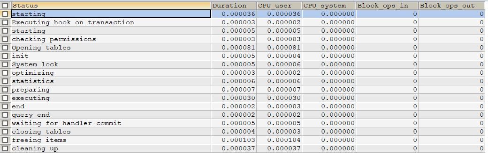
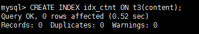
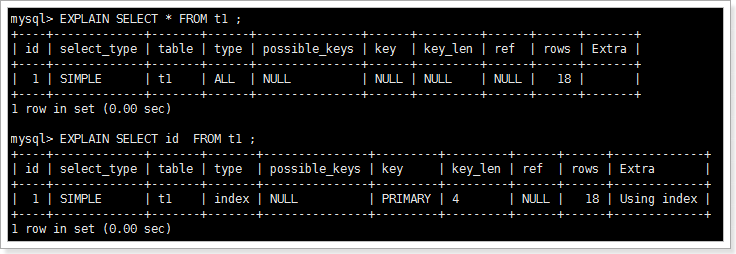
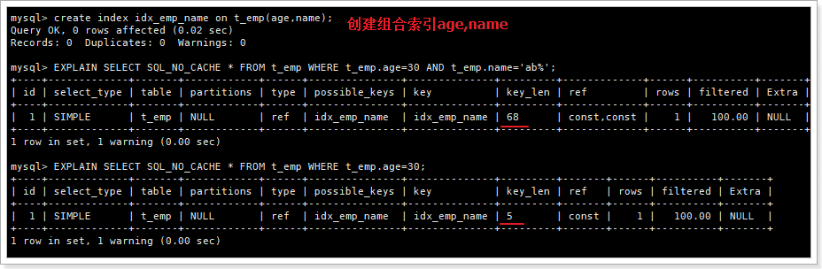
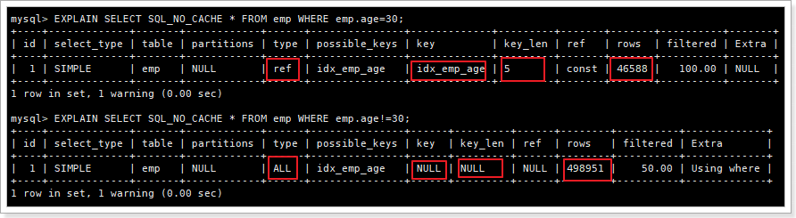
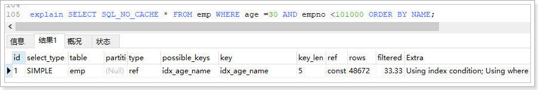

###  本资源由 itjc8.com 收集整理


# 1. MySQL简介


MySQL是一个关系型数据库管理系统，由瑞典MySQL AB公司开发，目前属于Oracle公司。 

MySQL是一种关联数据库管理系统，将数据保存在不同的表中，而不是将所有数据放在一个大仓库内，这样就增加了速度并提高了灵活性。

 

Mysql是开源的，所以你不需要支付额外的费用。

Mysql是可以定制的，采用了GPL协议，你可以修改源码来开发自己的Mysql系统。 

 

Mysql支持大型的数据库。可以处理拥有上千万条记录的大型数据库。

MySQL使用标准的SQL数据语言形式。

Mysql可以允许安装于多个系统上，并且支持多种语言。这些编程语言包括C、C++、Python、Java、Perl、PHP、Eiffel、Ruby和Tcl等。

MySQL支持大型数据库，支持5000万条记录的数据仓库，32位系统表文件最大可支持4GB，64位系统支持最大的表文件为8TB。

 


# 2. MySQL安装

官网下载地址：http://dev.mysql.com/downloads/mysql/

## 2.1 MySQL8新特性

MySQL 8版本在功能上做了显著的改进与增强

**1. 更简便的NoSQL支持**

从5.6版本开始，MySQL就开始支持简单的NoSQL存储功能。MySQL 8对这一功能做了优化，以更灵活的方式实现NoSQL功能。

**2. 更好的索引**
在查询中，正确地使用索引可以提高查询的效率。MySQL 8中新增了`隐藏索引`和`降序索引`。隐藏索引可以用来测试去掉索引对查询性能的影响。在查询中混合存在多列索引时，使用降序索引可以提高查询的性能。

**3.更完善的JSON支持**
MySQL从5.7开始支持原生JSON数据的存储，MySQL 8对这一功能做了优化，增加了聚合函数`JSON_ARRAYAGG()`和`JSON_OBJECTAGG()`，将参数聚合为JSON数组或对象，新增了行内操作符 ->>，是列路径运算符 ->的增强，对JSON排序做了提升，并优化了JSON的更新操作。(开发中一般使用mdb操作json：项目中使用频繁的比较复杂的多表联查数据，如果数据改动不频繁，可以直接以json的方式来保存，优势：查询速度快，代码中不需要对象和json之间转换。  如果数据的字段频繁修改，同一类数据字段不一定一样，表不是特别好设计，可以使用使用json存数据)

**4.InnoDB的变化**
`InnoDB是MySQL默认的存储引擎`，是事务型数据库的首选引擎，支持事务安全表（ACID），支持行锁定和外键。在MySQL 8 版本中，InnoDB在自增、索引、加密、死锁、共享锁等方面做了大量的`改进和优化`，并且支持原子数据定义语言（DDL），提高了数据安全性，对事务提供更好的支持。

**5.数据字典**
在之前的MySQL版本中，字典数据都存储在元数据文件和非事务表中。从MySQL 8开始新增了事务数据字典，在这个字典里存储着数据库对象信息，这些数据字典存储在内部事务表中。

**6.字符集支持**
MySQL 8中默认的字符集由`latin1`更改为`utf8mb4`，并首次增加了日语所特定使用的集合，utf8mb4_ja_0900_as_cs。

**7.窗口函数**
MySQL 8开始支持窗口函数。在之前的版本中已存在的大部分`聚合函数`在MySQL 8中也可以作为窗口函数来使用。


**等等...............**


使用课前资料中提供的mysql安装包。


## 2.2.   检查是否安装过MySQL

检查当前系统是否安装过mysql

执行安装命令前，先卸载已安装的mysql

### 2.1.1. 系统自带的mariadb

CentOS7默认安装mariadb

先执行查询：`rpm -qa|grep mariadb`

如果存在mariadb执行删除：`rpm -e --nodeps  mariadb-libs`


### 2.1.2. 卸载已安装的mysql

#### 1、mysql5.7

##### 1.0、 停掉mysql服务

```
service mysqld stop
```

##### **1.1、搜索安装的mysql**

```
rpm -qa|grep -i mysql
```


#####  **1.2、将搜索到的mysql安装程序全部卸载**


```
rpm -e --nodeps   mysql-community-client-5.7.16-1.el7.x86_64
rpm -e --nodeps   mysql-community-server-5.7.16-1.el7.x86_64
rpm -e --nodeps   mysql-community-common-5.7.16-1.el7.x86_64
rpm -e --nodeps   mysql-community-libs-5.7.16-1.el7.x86_64
```

#####  **1.3、搜索残留文件进行手动删除**

删除配置文件：rm -vf /etc/my.cnf.rpmsave

删除日志文件：rm -vf /var/log/mysqld.log 

   ```
find /  -name  mysql
rm  -rvf   mysql路径
   ```


#### 2、mysql8

##### **2.1 停止mysql服务**

```mysql
service mysqld stop
```

#####  **2.2 卸载**

```
rpm -e --nodeps mysql-community-client-plugins 
rpm -e --nodeps mysql-community-client 
rpm -e --nodeps mysql-community-server 
rpm -e --nodeps mysql-community-common 
rpm -e --nodeps mysql-community-libs 
```

##### **2.3 删除残留文件**

```
rm -rvf /etc/my.cnf.rpmsave 
rm -rvf /var/lib/mysql
rm -rvf /var/log/mysqld.log
```


## 2.3.   安装MySQL

### 2.3.1 安装包安装

####  **1、修改/tmp临时目录权限（必不可少）**

由于mysql安装过程中，会通过mysql用户在/tmp目录下新建tmp_db文件，所以请给/tmp较大的权限。执行 

```
chmod -R 777 /tmp
```

#### **2、将课件中的mysql安装包导入到虚拟机/opt目录下并安装**

```shell
rpm -ivh mysql-community-common-8.0.25-1.el7.x86_64.rpm

rpm -ivh mysql-community-client-plugins-8.0.25-1.el7.x86_64.rpm

rpm -ivh mysql-community-libs-8.0.25-1.el7.x86_64.rpm

rpm -ivh mysql-community-client-8.0.25-1.el7.x86_64.rpm

rpm -ivh mysql-community-server-8.0.25-1.el7.x86_64.rpm

```

查看安装版本：`mysqladmin --version`


#### 3、   MySQL服务初始化

执行下面的命令初始化：

```shell
mysqld --initialize --user=mysql
```

使用mysql系统用户以安全模式为 root 用户生成一个密码并将该密码标记为过期，登陆后你需要设置一个新的密码

查看密码：

```
# 查看记录临时密码的日志文件
cat /var/log/mysqld.log
# 或者
grep 'temporary' /var/log/mysqld.log
```


#### 4、 启动mysql服务

```shell
# 启动：
systemctl start mysqld.service
# 关闭：
systemctl stop mysqld.service
# 重启：
systemctl restart mysqld.service
# 查看状态：
systemctl status mysqld.service
```

#### 5、 修改初始化密码

要修改MySQL，首先必须启动MySQL服务，使用初始化密码登录后，才能修改密码：

首次登录：

```
mysql -hlocalhost -P3306 -uroot -p回车,然后录入初始化密码
```


修改密码：`ALTER USER 'root'@'localhost' IDENTIFIED BY 'new_password';`


**注意：**

- 在MySQL8.0中，如果第一次启动服务器分别执行了数据初始化命令`mysqld --initialize --user=mysql`和服务启动命令`systemctl start mysqld`，那么服务器默认没有密码校验策略，此时可以修改为任意密码。

- 如果第一次启动服务器直接执行了`systemctl start mysqld`命令，那么数据会被自动初始化，那么服务器默认具有密码校验策略，此时密码长度必须最少8位，至少有一个数字，一个大写字母，一个小写字母，一个特殊字符。（此密码校验策略和后面第8节提到的密码强度校验插件冲突）


### 2.3.2 docker安装

#### 1、在docker中创建并启动MySQL容器：

```shell
docker run -d \
-p 3316:3306 \
-v /atguigu/mysql/master/conf:/etc/mysql/conf.d \
-v /atguigu/mysql/master/data:/var/lib/mysql \
-e MYSQL_ROOT_PASSWORD=123456 \
--name atguigu-mysql-master \
mysql:8.0.29
```

#### 2、 修改mysql密码

```shell
#进入容器：env LANG=C.UTF-8 避免容器中显示中文乱码
docker exec -it atguigu-mysql-master env LANG=C.UTF-8 /bin/bash
#进入容器内的mysql命令行
mysql -uroot -p123456
#修改默认密码插件
ALTER USER 'root'@'%' IDENTIFIED WITH mysql_native_password BY '123456';
# 退出容器
```

#### 3、 重启mysql容器

```shell
docker restart atguigu-mysql-master
```

#### 4、 常见问题解决

如果mysql容器连接不上或者报错WARNING: IPv4 forwarding is disabled. Networking will not work.

先排除防火墙、网络问题

然后尝试如下方案：

```
# 修改配置文件：
vim /usr/lib/sysctl.d/00-system.conf
# 添加
net.ipv4.ip_forward=1
# 保存退出 重启网络服务
systemctl restart network
# 重启mysql容器
docker restart atguigu-mysql-master
```

## 2.4.   字符集问题

查看mysql编码（`show variables like ‘%character%’`），发现默认编码是utf8，无需修改


mysql8以前的版本默认编码时latin，需要手动修改

## 2.5.   远程访问MySQL(用户与权限管理)

### 2.5.0 远程连接问题

#### 1、防火墙 

接下来用宿主机sqlyog或者navicat客户端访问MySQL服务，如果等待一会才连接失败：一般是防火墙未关闭

```mysql
# 关闭防火墙或者开放端口号：
systemctl start firewalld.service
systemctl status firewalld.service
systemctl stop firewalld.service
systemctl enable firewalld.service
systemctl disable firewalld.service
-- 查看开放的端口号
firewall-cmd --list-all
-- 设置开放的端口号
firewall-cmd --add-service=http --permanent
firewall-cmd --add-port=3306/tcp --permanent
-- 重启防火墙
firewall-cmd --reload 
```

#### 2、账号不支持远程连接

默认情况下，mysql不允许远程连接。只允许localhost连接


执行：

```mysql
select host,user,select_priv, plugin,authentication_string  from mysql.user
ql.user;
```


`%` 表示所有远程通过 TCP方式的连接

`IP地址` 如 (192.168.1.2,127.0.0.1) 通过制定ip地址进行的TCP方式的连接

`机器名`：通过制定i网络中的机器名进行的TCP方式的连接

`::1`   IPv6的本地ip地址  等同于IPv4的 127.0.0.1

`localhost` 本地方式通过命令行方式的连接 ，比如mysql -u xxx -p 123xxx 方式的连接。

`User`: 表示用户名，同一用户通过不同方式链接的权限是不一样的。

`password`：密码，所有密码串通过 password(明文字符串) 生成的密文字符串。加密算法为MYSQLSHA1 ，不可逆 。

​        mysql 5.7 的密码保存到 authentication_string 字段中不再使用password 字段。

`plugin`: 表示生成密码的插件

​		mysql5.7及之前使用`mysql_native_password`

​		mysql8使用`caching_sha2_password`

`select_priv` , `insert_priv`等，为该用户所拥有的权限。

解决方案：

1. 创建新的用户

2. 修改root用户访问权限


### 2.5.1.    创建新用户

创建新用户并指定密码：`create user liuyan identified by 'liuyan';`


修改root用户密码：`set password =password('123456');`

修改某个用户的密码：`update mysql.user set authentication_string=password('123456') where user='liuyan';`

修改用户名：`update mysql.user set user='li4' where user='wang5';`

删除用户：`drop user li4 ;`

`flush privileges;`   #所有通过user表的修改，必须用该命令才能生效。

授权命令： **grant 权限1,权限2,…权限n on 数据库名称.表名称 to 用户名@用户地址 identified by ‘连接口令’;**该权限如果发现没有该用户，则会直接新建一个用户。

授予新创建用户权限：

```mysql
grant select,insert,delete,drop on testdb.* to liuyan@'%' ; # 给用户liuyan用本地命令行方式下，授予testdb这个库下的所有表的插删改查的权限。
create user zhangsan identified by 'zhangsan';
grant all privileges on *.* to zhangsan@'%';  #授予通过网络方式登录的的zhansan用户，对所有库所有表的全部权限，密码设为zhangsan.
flush privileges;#刷新权限
```

扩展：

查看当前用户权限：`show grants;`

查看当前用户的全局权限：`select  * from user ;`

查看某用户的某个表的权限：`select * from tables_priv;`

收回权限命令： 

**revoke  权限1,权限2,…权限n on 数据库名称.表名称  from  用户名@用户地址 ;**

收回全库全表的所有权限：`REVOKE ALL PRIVILEGES ON mysql.* FROM li4@localhost;`

收回mysql库下的所有表的插删改查权限：`REVOKE select,insert,update,delete ON mysql.* FROM li4@localhost;`

<font color='red'>必须用户重新登录后才能生效</font>

 

### 2.5.2.    修改root账户的host地址

root用户的当前主机配置信息为localhost。只允许本地使用。

**修改Host为通配符%**

```mysql
update user set host = '%' where user ='root';
```


 

### 2.5.3.    测试连接

 连接时出现如下问题：错误号码 2058


mysql5.7之前密码加密使用的插件是mysql_native_password，mysql8修改为caching_sha2_password

**解决方法：**一种是升级SQLyog和Navicat（新版SQLyog和Navicat不会出现此问题），另一种是把MySQL用户登录密码加密规则还原成mysql_native_password。

Linux下 mysql -u root -p 登录你的 mysql 数据库，然后 执行这条SQL：

```mysql
ALTER USER 'root'@'%' IDENTIFIED WITH mysql_native_password BY '123456';
flush privileges;
```

重新测试连接


## 2.6.  SQL大小写规范

### 2.6.1 Windows和Linux的区别 

**Windows环境：**

全部不区分大小写

**Linux环境：**

1、数据库名、表名、表的别名、变量名`严格区分大小写`；

2、列名与列的别名`不区分大小写`。

3、关键字、函数名称`不区分大小写`；

### 2.6.2 Linux下大小写规则设置（了解）

在MySQL 8中设置的具体步骤为：

```
1、停止MySQL服务 
2、删除数据目录，即删除 /var/lib/mysql 目录 
3、在MySQL配置文件（/etc/my.cnf ）的 [mysqld] 中添加 lower_case_table_names=1 
4、启动MySQL服务
```

> 注意：不建议在开发过程中修改此参数，将会丢失所有数据

## 2.7.   导入数据

把课前资料中的《1.数据准备.sql》导入到mysql数据库

## 2.8.   sql_mode

### 2.8.1 了解sql_mode

**宽松模式：**

执行错误的SQL或插入不规范的数据，也会被接受，并且不报错。

**严格模式：**

执行错误的SQL或插入不规范的数据，会报错。MySQL5.7版本开始就将sql_mode默认值设置为了严格模式。


**需求：根据部门id查询每个部门的员工平均年龄。**

sql_mode是个很容易被忽视的变量，默认值是空值（mysql5.5），在这种设置下是可以允许一些非法操作的，比如允许一些非法数据的插入。在生产环境必须将这个值设置为严格模式，所以开发、测试环境的数据库也必须要设置，这样在开发测试阶段就可以发现问题。


> 查看：show variables like 'sql_mode';
>

sql_mode常用值如下： 

ONLY_FULL_GROUP_BY：

​		对于GROUP BY聚合操作，如果在SELECT中的列，没有在GROUP BY中出现，那么这个SQL是不合法的，因为列不在GROUP BY从句中

NO_AUTO_VALUE_ON_ZERO：

​		该值影响自增长列的插入。默认设置下，插入0或NULL代表生成下一个自增长值。如果用户 希望插入的值为0，而该列又是自增长的，那么这个选项就有用了。

STRICT_TRANS_TABLES：

​		在该模式下，如果一个值不能插入到一个事务表中，则中断当前的操作，对非事务表不做限制。提高性能

NO_ZERO_IN_DATE：

​		在严格模式下，不允许日期和月份为零

NO_ZERO_DATE：

​		设置该值，mysql数据库不允许插入零日期，插入零日期会抛出错误而不是警告。

ERROR_FOR_DIVISION_BY_ZERO：

​		在INSERT或UPDATE过程中，如果数据被零除，则产生错误而非警告。如果未给出该模式，那么数据被零除时MySQL返回NULL

NO_AUTO_CREATE_USER：

​		禁止GRANT创建密码为空的用户

NO_ENGINE_SUBSTITUTION：

​		如果需要的存储引擎被禁用或未编译，那么抛出错误。不设置此值时，用默认的存储引擎替代，并抛出一个异常

PIPES_AS_CONCAT：

​		将"||"视为字符串的连接操作符而非或运算符，这和Oracle数据库是一样的，也和字符串的拼接函数Concat相类似

ANSI_QUOTES：

​		启用ANSI_QUOTES后，不能用双引号来引用字符串，因为它被解释为识别符

ORACLE：

​		设置等同：PIPES_AS_CONCAT, ANSI_QUOTES, IGNORE_SPACE, NO_KEY_OPTIONS, NO_TABLE_OPTIONS, NO_FIELD_OPTIONS, NO_AUTO_CREATE_USER

###  2.8.2 设置sql_mode

#### 1、临时设置

**查询sql_mode的值：**

```sql
SELECT @@session.sql_mode; 
SELECT @@global.sql_mode; 
-- 或者 
SHOW VARIABLES LIKE 'sql_mode'; --session级别
```


**临时设置sql_mode的值：**

```sql
SET GLOBAL sql_mode = 'mode1,model2,...'; --全局，要重新启动客户端生效，重启MySQL服务后失效
SET SESSION sql_mode = 'mode1,model2,...'; --当前会话生效效，关闭当前会话就不生效了。可以省略SESSION关键字
```

#### 2、持久化设置

**在 /etc/my.cnf 中配置，永久生效：**

```properties
[mysqld]
sql-mode = "mode1,model2,..."
```

# 3. MySQL逻辑架构

和其它数据库相比，MySQL有点与众不同，它的架构可以在多种不同场景中应用，并发挥良好作用。<font color='red'>主要体现在存储引擎的架构上，插件式的存储引擎架构将查询处理和其它的系统任务以及数据的存储提取相分离。</font>这种架构可以根据业务的需求和实际需要选择合适的存储引擎。

下图是MySQL5.7使用的经典架构图，MySQL 8中去掉了Caches&Buffers部分


1. 连接层

   最上层是一些客户端和连接服务，包含本地socket通信和大多数基于客户端/服务端工具实现的类似于tcp/ip的通信。主要完成一些类似于连接处理、授权认证、及相关的安全方案。在该层上引入了线程池的概念，为通过认证安全接入的客户端提供线程。同样在该层上可以实现基于SSL的安全链接。服务器也会为安全接入的每个客户端验证它所具有的操作权限。

2. 服务层

   a)    Management Serveices & Utilities： 系统管理和控制工具

   b)    SQL Interface: SQL接口

   ​		接受用户的SQL命令，并且返回用户需要查询的结果。比如select from就是调用SQL Interface

​		c)     Parser: 解析器

​				SQL命令传递到解析器的时候会被解析器验证和解析。解析器中SQL 语句进行`词法分析、语法分析、语义分析`，并为其创建`语法树`。


​		d)    Optimizer: 查询优化器。

​				SQL语句在查询之前会使用查询优化器对查询进行优化。 

​				用一个例子就可以理解： select uid,name from user where  gender= 1;

​				优化器来决定先投影还是先过滤。

​				这个select 查询先根据where 语句进行选取，而不是先将表全部查询出来以后再进行gender过滤

​				这个select查询先根据uid和name进行属性投影，而不是将属性全部取出以后再进行过滤

​		e)    Cache和Buffer： 查询缓存。

​				如果查询缓存有命中的查询结果，查询语句就可以直接去查询缓存中取数据。

​				这个缓存机制是由一系列小缓存组成的。比如表缓存，记录缓存，key缓存，权限缓存等

​				mysql8禁用记录缓存(查询缓存，数据库表一旦修改数据了查询缓存需要删除)

3. 引擎层

   存储引擎层，存储引擎真正的负责了MySQL中数据的存储和提取，服务器通过API与存储引擎进行通信。不同的存储引擎具有的功能不同，这样我们可以根据自己的实际需要进行选取。后面介绍MyISAM和InnoDB

4. 存储层

   数据存储层，主要是将数据存储在运行于裸设备的文件系统之上，并完成与存储引擎的交互。

## 3.1.   查询流程说明


首先，mysql的查询流程大致是：

​		<font color='red'>mysql客户端通过协议与mysql服务器建连接，发送查询语句，先检查查询缓存，如果命中，直接返回结果</font>，否则进行语句解析,也就是说，在解析查询之前，服务器会先访问查询缓存(query cache)——它存储SELECT语句以及相应的查询结果集。如果某个查询结果已经位于缓存中，服务器就不会再对查询进行解析、优化、以及执行。它仅仅将缓存中的结果返回给用户即可，这将大大提高系统的性能。

​		语法解析器和预处理：首先mysql通过关键字将SQL语句进行解析，并生成一颗对应的“解析树”。<font color='red'>mysql解析器将使用mysql语法规则验证和解析查询</font>；预处理器则根据一些mysql规则进一步检查解析树是否合法。

​		当解析树被认为是合法的了，<font color='red'>查询优化器将其转化成执行计划</font>。一条查询可以有很多种执行方式，最后都返回相同的结果。优化器的作用就是找到这其中最好的执行计划。

## 3.2.   SQL执行计划

利用`show profiles` 可以查看sql的执行周期。需要先开启该功能：查看参数表中profiling(性能分析工具)：

```mysql
show variables  like '%profiling%';
# 本次会话开启profiling
set profiling=1;
```

执行：

```mysql
select * from t_emp;

select * from t_dept;
```

1. 显示最近几次查询：

```mysql
show profiles;
```


2. 查看程序的具体执行步骤：

   ```mysql
   show profile cpu,block io for query 查询id
   ```

   show profile的常用查询参数。

   ​	①ALL：显示所有的开销信息。

   ​	②BLOCK IO：显示块IO开销。

   ​	③CONTEXT SWITCHES：上下文切换开销。

   ​	④CPU：显示CPU开销信息。

   ​	⑤IPC：显示发送和接收开销信息。

   ​	⑥MEMORY：显示内存开销信息。

   ​	⑦PAGE FAULTS：显示页面错误开销信息。
   
   ​	⑧SOURCE：显示和Source_function，Source_file，Source_line相关的开销信息。
   
   ​	⑨SWAPS：显示交换次数开销信息。
   
   **Mysql5.7：使用了查询缓存，执行计划如下**


**Mysql8: 取消了查询缓存，执行计划如下**



Executing hook on transaction: 启用事务

checking permissions：检查权限   

 Opening tables：打开表
 init ： 初始化
 System lock ：系统锁
 optimizing ： 优化sql
 statistics ： 统计
 preparing ：准备执行
 executing ：执行sql
 Sending data ：发送数据
 Sorting result ：排序
 end ：结束
 query end ：查询 结束
 closing tables ： 关闭表 ／去除TMP 表
 freeing items ： 释放物品
 cleaning up ：清理


## 3.3.   SQL语法顺序

随着Mysql版本的更新换代，其优化器也在不断的升级，优化器会分析不同执行顺序产生的性能消耗不同而动态调整执行顺序。

需求：查询每个部门年龄高于20岁的人数且高于20岁人数不能少于2人，显示人数最多的第一名部门信息

下面是经常出现的查询顺序：


 

## 3.4.   MySQL存储引擎

如何用命令查看：`show engines;`


也可以通过`show variables like '%storage_engine%';`查看默认的存储引擎。

 

### 3.4.1.    各引擎简介

1. InnoDB存储引擎

   InnoDB是MySQL的默认事务型引擎，它被设计用来<font color='red'>处理大量的短期(short-lived)事务</font>。除非有非常特别的原因需要使用其他的存储引擎，否则<font color='red'>应该优先考虑InnoDB引擎。</font>

2. MyISAM存储引擎

   MyISAM提供了大量的特性，包括全文索引、压缩、空间函数(GIS)等，但<font color='red'>MyISAM不支持事务和行级锁</font>，有一个毫无疑问的缺陷就是崩溃后无法安全恢复。

3. Archive引擎

   <font color='red'>Archive档案存储引擎只支持INSERT和SELECT操作</font>，在MySQL5.1之前不支持索引。

   Archive表适合日志和数据采集类应用。

   根据英文的测试结论来看，Archive表比MyISAM表要小大约75%，比支持事务处理的InnoDB表小大约83%。

4. Blackhole引擎

   <font color='red'>Blackhole引擎没有实现任何存储机制，它会丢弃所有插入的数据，不做任何保存。</font>但服务器会记录Blackhole表的日志，所以可以用于复制数据到备库，或者简单地记录到日志。但这种应用方式会碰到很多问题，因此并不推荐。 

5. CSV引擎 

   <font color='red'>CSV引擎可以将普通的CSV文件作为MySQL的表来处理，但不支持索引。</font>

   CSV引擎可以作为一种数据交换的机制，非常有用。

   CSV存储的数据直接可以在操作系统里，用文本编辑器，或者excel读取。

6. Memory引擎

   如果需要快速地访问数据，并且这些数据不会被修改，重启以后丢失也没有关系，那么使用Memory表是非常有用。Memory表至少比MyISAM表要快一个数量级。

7. Federated引擎

   Federated引擎<font color='red'>是访问其他MySQL服务器的一个代理</font>，尽管该引擎看起来提供了一种很好的跨服务器的灵活性，但也经常带来问题，因此默认是禁用的。

 

### 3.4.2.    MyISAM和InnoDB的区别(重点)

| **对比项**         | **MyISAM**                                                   | **InnoDB**                                                   |
| ------------------ | ------------------------------------------------------------ | ------------------------------------------------------------ |
| **外键**           | 不支持                                                       | 支持                                                         |
| **事务**           | 不支持                                                       | 支持                                                         |
| **行表锁**         | 表锁，即使操作一条记录也会锁住整个表   <font color='red'>不适合高并发的操作  </font> | 行锁,操作时只锁某一行，不对其它行有影响   <font color='red'>适合高并发的操作 </font> |
| **缓存**           | 只缓存索引，不缓存真实数据                                   | 不仅缓存索引还要缓存真实数据，对内存要求较高，而且内存大小对性能有决定性的影响 |
| **关注点**         | 节省资源、消耗少、简单业务                                   | 并发写、事务、更大资源                                       |
| **默认安装**       | Y                                                            | Y                                                            |
| **用户表默认使用** | N                                                            | Y                                                            |
| **自带系统表使用** | Y                                                            | N                                                            |

 

### 3.4.3.    阿里巴巴、淘宝用哪个


Percona 为 MySQL 数据库服务器进行了改进，在功能和性能上较 MySQL 有着很显著的提升。该版本提升了在高负载情况下的 InnoDB 的性能、为 DBA 提供一些非常有用的性能诊断工具；另外有更多的参数和命令来控制服务器行为。

该公司新建了一款存储引擎叫xtradb完全可以替代innodb,并且在性能和并发上做得更好,

阿里巴巴大部分mysql数据库其实使用的percona的原型加以修改。


# 4. SQL预热

常见七种通用的Join查询


 

练习：

#1. 所有有门派的人员以及部门信息 （ A、B两表共有）

#2. 列出所有用户，并显示其部门信息 （A的全集）

#3. 列出有部门的人员以及所有部门（B的全集）

#4. 所有不入门派的人员 （A的独有）

#5. 所有没有员工的部门（B的独有）

#6. 列出所有人员和部门的对照关系(AB全有)

\#MySQL Full Join的实现 因为<font color='red'>MySQL不支持FULL JOIN</font>,下面是替代方法

\#<font color='red'>left join + union(可去除重复数据)+ right join</font>

#7. 列出所有没部门的人员和没人的部门（A的独有+B的独有）

```mysql
#1.    所有有门派的人员信息 （ A、B两表共有）

SELECT * FROM t_emp a INNER JOIN t_dept b ON a.deptId=b.id;

#2.    列出所有用户，并显示其机构信息 （A的全集）

SELECT * FROM t_emp a LEFT JOIN t_dept b ON a.deptId=b.id;

#3.    列出所有门派（B的全集）

SELECT * FROM t_emp a RIGHT JOIN t_dept b ON a.deptId=b.id;

#4.    所有不入门派的人员 （A的独有）

SELECT * FROM t_emp a LEFT JOIN t_dept b ON a.deptId=b.id WHERE a.deptId IS NULL;

#5.    所有没人入的门派（B的独有）

SELECT * FROM t_emp a RIGHT JOIN t_dept b ON a.deptId=b.id WHERE a.deptId IS NULL;

#6.    列出所有人员和机构的对照关系(AB全有)

#MySQL Full Join的实现 因为MySQL不支持FULL JOIN,下面是替代方法

#left join + union(可去除重复数据)+ right join

SELECT * FROM t_emp a LEFT JOIN t_dept b ON a.deptId=b.id

UNION

SELECT * FROM t_emp a RIGHT JOIN t_dept b ON a.deptId=b.id WHERE a.deptId IS NULL;

#7.    列出所有没入派的人员和没人入的门派（A的独有+B的独有）

SELECT * FROM t_emp a LEFT JOIN t_dept b ON a.deptId=b.id WHERE a.deptId IS NULL

UNION

SELECT * FROM t_emp a RIGHT JOIN t_dept b ON a.deptId=b.id WHERE a.deptId IS NULL;
```


练习：

1. 求各个门派对应的掌门人名称

2. 求所有当上掌门人的平均年龄

3. 求所有人物对应的掌门名称

```mysql
# 求各个门派对应的掌门人名称
select * from t_dept a left join t_emp b on a.CEO=b.id;

# 求所有当上掌门人的平均年龄
select avg(a.age) from t_emp a inner join t_dept b on a.id=b.CEO;

# 求所有人物对应的掌门名称
# No1
select c.name,c.id,v.name from t_emp c 
	LEFT JOIN (select a.deptName,a.id,b.name from t_dept a left join t_emp b on a.ceo=b.id) v on c.deptId=v.id
# No2
select c.name,c.id,v.name from (select a.deptName,a.id,b.name from t_dept a left join t_emp b on a.ceo=b.id) v
	LEFT JOIN t_emp c on c.deptId=v.id
# No3
select a.name,a.id,c.name from t_emp a 
	LEFT JOIN t_dept b on a.deptId=b.id
	LEFT JOIN t_emp c on b.ceo=c.id
# No4
select a.name,a.id,(select c.name from t_emp c where c.id=b.ceo) from t_emp a 
	LEFT JOIN t_dept b on a.deptId=b.id
```


作业：

<font color='red'>课前资料中的《2.作业8个sql.txt》</font>


# 5. 索引 

## 5.1 索引简介

影响性能下降SQL慢体现在：执行时间长或者等待时间长

影响sql性能的常见情况：

l  数据过多：分库分表(根据微服务划分库、按照地域或时间分表存储、按照数据的特定字段对分库数量求余)

l  关联了太多的表，太多join：允许表出现冗余字段减少联查      SQL优化

l  没有充分利用到索引：索引建立

l  服务器调优及各个参数设置：调整my.cnf

### 5.1.1.    什么是索引

MySQL官方对索引的定义为：索引（Index）是帮助MySQL高效获取数据的数据结构。
可以得到索引的本质：<font color='red'>索引是数据结构。</font>

索引的目的在于<font color='red'>提高查询效率</font>，可以类比字典，

如果要查“mysql”这个单词，我们肯定需要定位到m字母，然后从上往下找到y字母，再找到剩下的sql。

如果没有索引，那么你可能需要a----z，如果我想找到Java开头的单词呢？或者Oracle开头的单词呢？

是不是觉得如果没有索引，这个事情根本无法完成？

<font color='red'>你可以简单理解为“排好序的快速查找数据结构”。</font>

​		在数据之外，数据库系统还维护着满足特定查找算法的数据结构，这些数据结构以某种方式引用（指向）数据，这样就可以在这些数据结构上实现高级查找算法。这种数据结构，就是索引。下图就是一种可能的索引方式示例：


​		左边是数据表，一共有两列七条记录，最左边的是数据记录的物理地址
​		为了加快Col2的查找，可以维护一个右边所示的<font color='red'>二叉查找树，每个节点分别包含索引键值和一个指向对应数据记录物理地址的指针</font>，这样就可以运用二叉查找在一定的复杂度内获取到相应数据，从而快速的检索出符合条件的记录。


结论：

​		**数据本身之外，数据库还维护着一个满足特定查找算法的数据结构，这些数据结构以某种方式指向数据，这样就可以在这些数据结构的基础上实现高级查找算法，这种数据结构就是索引。**


​	一般来说索引本身也很大，不可能全部存储在内存中，因此索引往往<font color='red'>以索引文件的形式存储的磁盘上</font>


**AVLTree 高度平衡树**

增加和删除可能需要通过一次或多次[树旋转](https://baike.baidu.com/item/树旋转)来重新平衡这个树.

`具有以下特点：`

- 它是一棵空树或它的左右两个子树的高度差的绝对值不超过1
- 并且左右两个子树都是一棵平衡二叉树。


**多叉树**

多叉树（multiway tree）允许`每个节点可以有更多的数据项和更多的子节点`。2-3树，2-3-4树就是多叉树，多叉树通过`重新组织节点，减少节点数量，增加分叉，减少树的高度`，能对二叉树进行优化。


### 5.1.2.    索引的优劣势

优势：

1. 类似大学图书馆建书目索引，<font color='red'>提高数据检索的效率</font>，降低数据库的IO成本。

2. 通过索引列对数据进行排序或分组，<font color='red'>降低数据排序的成本</font>，降低了CPU的消耗。

劣势：

1. 虽然索引大大提高了查询速度，同时却会<font color='red'>降低更新表的速度</font>，如对表进行INSERT、UPDATE和DELETE。因为更新表时，MySQL不仅要保存数据，还要保存一下索引文件。每次更新添加了索引列的字段，都会调整因为更新所带来的键值变化后的索引信息

2. 实际上索引也是一张表，该表保存了主键与索引字段，并指向实体表的记录，所以<font color='red'>索引列也是要占用空间的</font>


## 5.2.   MySQL的索引结构

### 5.2.1.    BTree索引

- `B-Tree即B树，Balance Tree，平衡树,它的高度远小于平衡二叉树的高度`。
- 2-3树是最简单的B树结构。
- `B树的阶：`节点的最多子节点个数。比如2-3树的阶是3，2-3-4树的阶是4。


【初始化介绍】 
一颗b树，浅蓝色的块我们称之为一个磁盘块(innodb默认16kb一个磁盘块)，可以看到每个磁盘块包含几个<font color='red'>数据项（深蓝色所示）、指向关键字具体信息的指针（红色）和指向其他磁盘块的指针（黄色所示）</font>
如磁盘块1包含数据项17和35，包含指针P1、P2、P3，
P1表示小于17的磁盘块，P2表示在17和35之间的磁盘块，P3表示大于35的磁盘块。

【查找过程】
如果要查找数据项29，那么首先会把磁盘块1由磁盘加载到内存，此时发生一次IO，在内存中用二分查找确定29在17和35之间，锁定磁盘块1的P2指针，内存时间因为非常短（相比磁盘的IO）可以忽略不计，通过磁盘块1的P2指针的磁盘地址把磁盘块3由磁盘加载到内存，发生第二次IO，29在26和30之间，锁定磁盘块3的P2指针，通过指针加载磁盘块8到内存，发生第三次IO，同时内存中做二分查找找到29，结束查询，总计三次IO。

真实的情况是，3层的b树可以表示上百万的数据，如果上百万的数据查找<font color='red'>只需要三次IO</font>，性能提高将是巨大的，如果没有索引，每个数据项都要发生一次IO，那么总共需要百万次的IO，显然成本非常非常高。

### 5.2.2.    B+Tree索引

#### 1、数据结构


#### 2、B+Tree与B-Tree 的区别

　1）B-树的关键字和记录是放在一起的，叶子节点可以看作外部节点，不包含任何信息；<font color='red'>B+树的非叶子节点中只有关键字和指向下一个节点的索引，记录只放在叶子节点中。树的高度会更矮胖，IO次数也会更少。</font>
　 2）在B-树中，越靠近根节点的记录查找时间越快，只要找到关键字即可确定记录的存在；而B+树中每个记录的查找时间基本是一样的，都需要从根节点走到叶子节点，而且在叶子节点中还要再比较关键字。从这个角度看B-树的性能好像要比B+树好，而在实际应用中却是B+树的性能要好些。因为B+树的非叶子节点不存放实际的数据，这样每个节点可容纳的元素个数比B-树多，树高比B-树小，这样带来的好处是减少磁盘访问次数。尽管B+树找到一个记录所需的比较次数要比B-树多，但是一次磁盘访问的时间相当于成百上千次内存比较的时间，因此实际中B+树的性能可能还会好些，而且B+树的叶子节点使用指针连接在一起，方便顺序遍历（例如查看一个目录下的所有文件，一个表中的所有记录等），这也是很多数据库和文件系统使用B+树的缘故。 
　
思考：为什么说B+树比B-树更适合实际应用中操作系统的文件索引和数据库索引？ 
1) **B+树的磁盘读写代价更低** 
　　B+树的内部结点并没有指向关键字具体信息的指针。因此其内部结点相对B 树更小。如果把所有同一内部结点的关键字存放在同一盘块中，那么盘块所能容纳的关键字数量也越多。一次性读入内存中的需要查找的关键字也就越多。相对来说IO读写次数也就降低了。 
2) **B+树的查询效率更加稳定** 
　　由于非终结点并不是最终指向文件内容的结点，而只是叶子结点中关键字的索引。所以任何关键字的查找必须走一条从根结点到叶子结点的路。所有关键字查询的路径长度相同，导致每一个数据的查询效率相当。

#### 3、数据页大小

查看mysql文件页大小（16K）：

```mysql
SHOW GLOBAL STATUS LIKE '%page_size%'
```


**为什么mysql页文件默认16K？**
假设我们一行数据大小为1K，那么一页就能存16条数据，也就是一个叶子节点能存16条数据；再看非叶子节点，假设主键ID为bigint类型，那么长度为8B，指针大小在Innodb源码中为6B，一共就是14B，那么一页里就可以存储16K/14B=1170个(主键+指针)

```
一颗高度为2的B+树能存储的数据为:1170*16=18720条，
一颗高度为3的B+树能存储的数据为：1170*1170*16=21902400（千万级）
```


### 5.2.3.    聚簇索引与非聚簇索引

**聚簇索引**：

> 将数据存储与索引放到了一块，找到索引也就找到了数据。

> `页内的记录`是按照`主键`的大小顺序排成一个`单向链表` 。

> `页和页之间`也是根据页中记录的`主键`的大小顺序排成一个`双向链表` 。

> 非叶子节点存储的是记录的`主键+页号`。叶子节点存储的是`完整的用户记录`。

**非聚簇索引**：

> 将数据存储与索引分开结构，索引结构的叶子节点指向了数据的对应行，myisam通过key_buffer把索引先缓存到内存中，当需要访问数据时（通过索引访问数据），在内存中直接搜索索引，然后通过索引找到磁盘相应数据，这也就是为什么索引不在key buffer命中时，速度慢的原因 

澄清一个概念：<font color='red'>innodb中，非聚簇索引又称辅助索引，辅助索引访问数据总是需要二次查找。辅助索引叶子节点存储的不再是行的物理位置，而是主键值。</font>


InnoDB使用聚簇索引，将**主键组织到一棵B+树**中，而**行数据就储存在叶子节点**上，若使用"where id = 14"这样的条件查找主键，则**按照B+树的检索算法即可查找到对应的叶节点，之后获得行数据**。

若**对Name列进行条件搜索，则需要两个步骤**：**第一步在辅助索引B+树中检索Name，到达其叶子节点获取对应的主键**。第二步**使用主键在主索引B+树种再执行一次B+树检索操作，最终到达叶子节点即可获取整行数据**。（**重点在于通过其他键需要建立辅助索引**）

聚簇索引的好处：

- 由于**行数据和叶子节点存储在一起，同一页中会有多条行数据，访问同一数据页不同行记录时，已经把页加载到了Buffer中，再次访问的时候，会在内存中完成访问**，不必访问磁盘。这样**主键和行数据是一起被载入内存的，找到叶子节点就可以立刻将行数据返回**了，**如果按照主键Id来组织数据，获得数据更快**。

- 聚簇索引适合用在排序的场合，非聚簇索引不适合

- 取出一定范围数据的时候，使用聚簇索引

- 二级索引需要两次索引查找，而不是一次才能取到数据，因为存储引擎第一次需要通过二级索引找到索引的叶子节点，从而找到数据的主键，然后在聚簇索引中用主键再次查找索引，再找到数据

聚簇索引的限制：

- 对于mysql数据库目前只有innodb数据引擎支持聚簇索引，而Myisam并不支持聚簇索引。
- 由于数据物理存储排序方式只能有一种，所以每个Mysql的表只能有一个聚簇索引。
  - 一般情况下就是该表的主键。
  - 如果没有primary key,会以(not null unique key)非空的唯一索引保存数据
  - 内部自己生成一个字段保存数据
- 为了充分利用聚簇索引的聚簇的特性，所以innodb表的主键列尽量选用有序非空的字段，而不建议用无序的id，比如uuid这种。

### 5.2.4. 回表

通过非聚簇索引查找到主键值之后仍然需要到聚簇索引中再查询一遍，这个过程称为**回表**

**问题：**为什么我们还需要一次`回表`操作呢？直接把完整的用户记录放到叶子节点不OK吗？

**回答：**
如果把完整的用户记录放到叶子节点是可以不用回表。但是`太占地方`了，相当于每建立一棵B+树都需要把所有的用户记录再都拷贝一遍，这就有点太浪费存储空间了。

### 5.2.5. 联合索引

 基于多个字段创建的索引就是联合索引，也称为复合索引，比如我们创建索引**create index idx on table(a,b,c)** 我们称在字段a,b,c上创建了一个联合索引。同时以这三个列的大小作为排序规则。

- 记录先按照a列排序
- a列值相同时使用b列排序
- b列值相同时使用c列排序

然后将排好序的abc三列的值组织到非聚簇索引索引结构中。

联合索引结构：


## 5.3.   MySQL索引分类

1. 主键索引：设定为主键后数据库会自动建立索引，innodb为聚簇索引
2. 单值索引：即一个索引只包含单个列，一个表可以有多个单列索引
3. 唯一索引：索引列的值必须唯一，但允许有空值
4. 复合索引：即一个索引包含多个列

```mysql
CREATE TABLE customer (
	id INT (10) UNSIGNED AUTO_INCREMENT,
	customer_no VARCHAR (200),
	customer_name VARCHAR (200),
	PRIMARY KEY (id), # 主键索引
	KEY idx_name (customer_name), # 单值索引
	UNIQUE KEY uk_name (customer_name), # 唯一索引
	KEY idx_no_name (customer_no, customer_name) # 复合索引
);
```


单独建索引：

```mysql
# 使用CREATE语句：CREATE  [UNIQUE ]  INDEX [indexName] ON table_name(column))
CREATE INDEX idx_customer_name ON customer(customer_name);  # 单值索引
CREATE UNIQUE INDEX idx_customer_no ON customer(customer_no); # 唯一索引
CREATE INDEX idx_no_name ON customer(customer_no,customer_name); # 复合索引
# 使用ALTER命令：
ALTER TABLE tbl_name ADD PRIMARY KEY (column_list);
# 该语句添加一个主键，这意味着索引值必须是唯一的，且不能为NULL。
ALTER TABLE tbl_name ADD UNIQUE index_name (column_list);
# 这条语句创建索引的值必须是唯一的（除了NULL外，NULL可能会出现多次）。
ALTER TABLE tbl_name ADD INDEX index_name (column_list); 
# 添加普通索引，索引值可出现多次。
ALTER TABLE tbl_name ADD FULLTEXT index_name (column_list);
# 该语句指定了索引为 FULLTEXT ，用于全文索引。
```

删除索引：**DROP INDEX [indexName] ON mytable;** 

```mysql
ALTER TABLE customer drop PRIMARY KEY;  # 删除主键索引

DROP INDEX idx_customer_name  on customer; # 删除单值、唯一、复合索引
```

查看索引：**SHOW INDEX FROM table_name\G;**

修改主键索引：必须先删除掉(drop)原索引，再新建(add)索引


## 5.4.   索引的使用场景

哪些情况需要创建索引：

- 主键自动建立唯一索引
- 频繁作为查询条件的字段应该创建索引
- 查询中与其它表关联的字段，外键关系建立索引
- 单键/组合索引的选择问题， 组合索引性价比更高
- 查询中排序的字段，排序字段若通过索引去访问将大大提高排序速度
- 查询中统计或者分组字段

哪些情况不要创建索引：

- 表记录太少

- 经常增删改的表或者字段。

  Why：提高了查询速度，同时却会降低更新表的速度，如对表进行INSERT、UPDATE和DELETE。因为更新表时，MySQL不仅要保存数据，还要保存一下索引文件

- Where条件里用不到的字段不创建索引

- 过滤性不好的不适合建索引

- 有大量重复数据的列上。


# 6. 索引优化

四种：1.主键 2.单值 3.唯一 4.复合

## 6.1.   性能分析（explain）

mysql5.6以后优化器做了很多改进，执行时会自动进行大量的优化，很多现象需要在5.5才能演示成功。

### 6.1.1.    explain是什么?

**模拟优化器查看执行计划**

使用EXPLAIN关键字可以模拟优化器执行SQL查询语句，从而知道MySQL是如何处理你的SQL语句的。分析你的查询语句或是表结构的**性能瓶颈**


### 6.1.2.    explain能干什么？

- <font color='red'>表的读取顺序</font>

- 那些索引可以使用

- 数据读取操作的操作类型

- <font color='red'>那些索引被实际使用</font>

- 表之间的引用

- <font color='red'>每张表有多少行被物理查询</font>


### 6.1.3.    explain怎么玩？

<font color='red'>explain + SQL语句</font>

官方文档：https://dev.mysql.com/doc/refman/8.0/en/explain-output.html#explain-extra-information

数据准备：

```mysql
CREATE TABLE t1(id INT(10) AUTO_INCREMENT, content VARCHAR(100) NULL, PRIMARY KEY (id));
CREATE TABLE t2(id INT(10) AUTO_INCREMENT, content VARCHAR(100) NULL, PRIMARY KEY (id));
CREATE TABLE t3(id INT(10) AUTO_INCREMENT, content VARCHAR(100) NULL, PRIMARY KEY (id));
CREATE TABLE t4(id INT(10) AUTO_INCREMENT, content VARCHAR(100) NULL, PRIMARY KEY (id));

# 以下新增sql多执行几次，以便演示
INSERT INTO t1(content) VALUES(CONCAT('t1_',FLOOR(1+RAND()*1000)));
INSERT INTO t2(content) VALUES(CONCAT('t2_',FLOOR(1+RAND()*1000)));
INSERT INTO t3(content) VALUES(CONCAT('t3_',FLOOR(1+RAND()*1000)));
INSERT INTO t4(content) VALUES(CONCAT('t4_',FLOOR(1+RAND()*1000)));
```

演示：explain select * from t1, t2, t3 where t1.id=t2.id and t2.id=t3.id;


### 6.1.4.    各字段解释

#### 6.1.4.1.    id(重要)

select查询的序列号，表示查询中执行select子句或操作表的顺序

三种情况：

1. id相同，执行顺序由上至下。例如上图

2. id不同，如果是子查询，id的序号会递增，id值越大优先级越高，越先被执行

   ```sql
   EXPLAIN SELECT * 
   FROM t1 WHERE t1.content =(
   	SELECT t2.content
   	FROM t2 WHERE t2.content=(
   		SELECT t3.content
   		FROM t3
   		WHERE t3.content=""
   	)
   );
   ```

   

3. id既有相同又有不同

   

id为NULL最后执行。

关注点：<font color='red'>每个id号码，表示一趟独立的查询。一个sql 的查询趟数越少越好。</font>


#### 6.1.4.2.    select_type(不会用于优化)

查询的类型，主要是用于区别普通查询、联合查询、子查询等的复杂查询

| `SIMPLE`               | 简单的 SELECT(没有 使用UNION或者 子查询（PS：单表查询）)     |
| ---------------------- | ------------------------------------------------------------ |
| `PRIMARY`              | 最外层的Select 作为primary 查询。(PS:含有子查询的情况,但是并不复杂)案例1 |
| `DERIVED`              | 在from 查询语句中的（派生，嵌套很多）子查询.(PS:递归操作这些子查询) |
| `SUBQUERY`             | 在SELECT或WHERE列表中包含了子查询。案例2                     |
| `DEPENDENT SUBQUERY`   | 第一个查询是子查询，依赖于外部查询（相关查询）。案例3        |
| `MATERIALIZED`         | 在非相关子查询中 并且需要进行物化时会出现MATERIALIZED关键词。案例4 |
| `UNCACHEABLE SUBQUERY` | 子查询结果(系统变量)不能被缓存， 而且必须重写（分析）外部查询的每一行。案例5 |
| `UNION`                | 若第二个SELECT出现在UNION之后，则被标记为UNION。案例6<br />若UNION包含在FROM子句的子查询中,外层SELECT将被标记为：DERIVED |
| `UNION RESULT`         | 结果集是通过union 而来的。案例6                              |

案例1：explain select * from (select t2.* from t2) s2


案例2：explain select * from t1 where t1.id=(select t2.id from t2 where t2.id=1)


案例3：explain select t1.*,(select t2.content from t2 where t2.id=t1.id) from t1 where t1.id=1;


案例4：explain select * from t1 where t1.content in (select t2.content from t2 where t2.content in (select t3.content from t3 where t3.content=''))  #需要5.7以后版本演示


案例5：EXPLAIN SELECT * from t1 where t1.id=(select t2.id from t2 where t2.id=@@sort_buffer_size);


案例6：explain select * from t1 UNION select * from t2;


#### 6.1.4.3.    table

显示这一行的数据是关于哪张表的


#### 6.1.4.4.    partitions

代表分区表中的命中情况，非分区表，该项为null


#### 6.1.4.5.    type(重要)


type显示的是访问类型，是较为重要的一个指标，结果值从最好到最坏依次是： 

null>system > const > eq_ref > ref > fulltext > ref_or_null > index_merge > unique_subquery > index_subquery > <font color='#FFD700'>range</font> ><font color="orange"> index</font> > <font color="red">ALL </font>

常见：system > const > eq_ref > ref > <font color='#FFD700'>range</font> ><font color="orange"> index</font> > <font color="red">ALL </font>

**一般来说，得保证查询至少达到range级别，最好能达到ref。**

 **null**:   MySQL不访问任何表或索引，直接返回结果

**system**：表只有一行记录（等于系统表），这是const类型的特列，平时不会出现，这个也可以忽略不计。

**const**：表示通过索引一次就找到了,const用于比较primary key或者unique索引。因为只匹配一行数据，所以很快。如将主键置于where列表中，MySQL就能将该查询转换为一个常量。（select * from t1 where t1.id=1）

**eq_ref**：唯一性索引扫描，对于每个索引键，表中只有一条记录与之匹配。常见于主键或唯一索引扫描。（select * from t1,t2 where t1.id=t2.id）

**ref**:  使用非唯一索引扫描或唯一索引前缀扫描，返回单条记录，常出现在关联查询中

**range**：只检索给定范围的行，使用一个索引来选择行。key 列显示使用了哪个索引，一般就是在你的where语句中出现了between、<、>、in等的查询。这种范围扫描索引扫描比全表扫描要好，因为它只需要开始于索引的某一点，而结束语另一点，不用扫描全部索引。（select * from t1 where t1.id<10）

**index**：出现index是sql使用了索引但是没用通过索引进行过滤，一般是使用了覆盖索引或者是利用索引进行了排序分组。（explain select id from t1）

**all**：Full Table Scan，将遍历全表以找到匹配的行。（explain select * from t1）

**index_merge**：在查询过程中需要多个索引组合使用，通常出现在有 or 的关键字的sql中。

**ref_or_null**：对于某个字段既需要关联条件，也需要null值得情况下。查询优化器会选择用ref_or_null连接查询。

**index_subquery**：利用索引来关联子查询，不再全表扫描。

**unique_subquery**：该联接类型类似于index_subquery。 子查询中的唯一索引。

创建索引：

 

index_merge:

```mysql
EXPLAIN SELECT * FROM t3 WHERE t3.content IS NULL OR t3.id=10;
```


ref_or_null:

```mysql
EXPLAIN SELECT * FROM t3 WHERE t3.content IS NULL OR t3.content='aaaa';
```


index_subquery:

```mysql
EXPLAIN SELECT * FROM t2 WHERE t2.content IN (SELECT t3.content FROM t3);
```


unique_subquery:

```mysql
EXPLAIN SELECT * FROM t2 WHERE t2.id IN (SELECT t3.id FROM t3);
```


#### 6.1.4.6.    possible_keys

显示可能应用在这张表中的索引，一个或多个。
查询涉及到的字段上若存在索引，则该索引将被列出，**但不一定被查询实际使用**


#### 6.1.4.7.    key(优化重要指标)

实际使用的索引。如果为NULL，则没有使用索引。

**查询中若使用了覆盖索引，则该索引和查询的select字段重叠**

 


#### 6.1.4.8.    key_len(重要)

表示索引中使用的字节数，可通过该列计算查询中使用的索引的长度。 

key_len字段能够帮你检查是否充分的利用上了索引。



如何计算
1 、先看索引上字段的类型+长度比如 int=4 ;  varchar(20) =20 ; char(20) =20  

2  、如果是varchar或者char这种字符串字段，视字符集要乘不同的值，比如utf8mb3要乘 3(MySQL5.7)，如果是utf8mb4要乘4，,GBK要乘2
3 、varchar这种动态字符串要加2个字节
4、 允许为空的字段要加1个字节  

索引字段最好不要为NULL，因为NULL让统计更加复杂，并且需要额外一个字节的存储空间。

#### 6.1.4.9.    ref

显示索引的哪一列被使用了，如果可能的话，是一个常数。哪些列或常量被用于查找索引列上的值


#### 6.1.4.10.    rows

rows列显示MySQL认为它执行查询时必须检查的行数。**越少越好**


#### 6.1.4.11.    filtered

这个字段表示存储引擎返回的数据在server层过滤后，剩下多少满足查询的记录数量的比例，注意是百分比，不是具体记录数，`值越大越好`。


#### 6.1.4.12.    extra(重要)

包含不适合在其他列中显示但十分重要的额外信息，通过这些额外信息来`理解MySQL到底将如何执行当前的查询语句`。MySQL提供的额外信息有好几十个，这里只挑比较重要的介绍。

<font color="red">**Using filesort**</font>：说明mysql会对数据使用一个外部的索引排序，而不是按照表内的索引顺序进行读取。
MySQL中无法利用索引完成的排序操作称为“文件排序”


这类SQL语句性能极差，需要进行优化。

在一个非索引列上进行了order by，就会触发filesort，常见的优化方案是，在order by的列上添加索引，避免每次查询都全量排序(只查询索引列的值)。

<font color="red">**Using temporary**</font>：使了用临时表保存中间结果,MySQL在对查询结果排序时使用临时表。常见于排序 order by 和分组查询 group by。


group by和order by同时存在，且作用于不同的字段时，就会建立临时表，以便计算出最终的结果集。

**USING index**：利用索引进行了排序或分组。表示相应的select操作中使用了覆盖索引(Covering Index)，避免访问了表的数据行，效率不错！（EXPLAIN select * from t_emp where age=30 ORDER BY name）
如果同时出现using where，表明索引被用来执行索引键值的查找;
如果没有同时出现using where，表明索引只是用来读取数据而非利用索引执行查找。

**Using where**：表明使用了where过滤

<font color="red">**using join buffer**</font>：使用了连接缓存，非主键关联(mysql8`Using join buffer (hash join)` 速度要好于 mysql5.7`Using join buffer (Block Nested Loop)` )


**impossible where**：where子句的值总是false，不能用来获取任何元组。（EXPLAIN select * from t_emp where false;）

**select tables optimized away**：在没有GROUPBY子句的情况下，基于索引优化MIN/MAX操作或者
对于MyISAM存储引擎优化COUNT(*)操作，不必等到执行阶段再进行计算，查询执行计划生成的阶段即完成优化。

在innodb中：

 

在Myisam中：


### 6.1.5.    小结

**表的读取顺序：id**

​              id趟数越少越好，id相同执行顺序由上至下，id不同 大的先执行

查询方式：select_type

那些索引可以使用：possible_keys

**数据读取操作的操作类型：type**

​	range   index  all

**那些索引被实际使用：key**

​			创建的索引是否能够被实际应用

**使用索引的长度：key_len**

​			命中的索引匹配的长度(用来判断索引是否被完全利用)

​			计算索引长度： 

​					utf-8     

​							varchar(len)  =使用len*3+2   (如果字段可以为null，再+1)

​							char(len)  =使用len*3 (如果字段可以为null，再+1)

​							int(len)    =  4  (如果字段可以为null，再+1)

表之间的引用：table

**每张表有多少行被物理查询：rows**

​			行数越少越好(多表联查时 被驱动表的rows如果使用索引了一般非常小)

**额外优化信息：extra**

​			using  join buffer(多表联查)、using filesort(排序)和 using temporary(分组)    需要考虑优化

​			其他情况性能都可以无需优化


### 6.1.6 Json格式的执行计划

`EXPLAIN`语句输出中缺少了一个衡量执行计划好坏的重要属性 —执行计划花费的成本，在`EXPLAIN`单词和真正的查询语句中间加上`FORMAT=JSON`。

```mysql
EXPLAIN FORMAT=json SELECT * FROM t_emp;
```

```json
{
  "query_block": {
    "select_id": 1,
    "cost_info": {
      "query_cost": "1.25" // 查询耗时：单位毫秒
    },
    "table": {
      "table_name": "t_emp",
      "access_type": "ALL",
      "rows_examined_per_scan": 10,
      "rows_produced_per_join": 10,
      "filtered": "100.00",
      "cost_info": {
        "read_cost": "0.25",//io耗时
        "eval_cost": "1.00",//获取处理返回结果耗时
        "prefix_cost": "1.25",
        "data_read_per_join": "800"//读取的数据量
      },
      "used_columns": [//投影列
        "id",
        "name",
        "age",
        "deptId",
        "empno"
      ]
    }
  }
}
```


## 6.2.   数据准备

在做优化之前，要准备大量数据。接下来创建两张表，并往员工表里插入50W数据，部门表中插入1W条数据。

建表sql：

```mysql
CREATE TABLE `dept` (
	`id` INT(11) NOT NULL AUTO_INCREMENT,
	`deptName` VARCHAR(30) DEFAULT NULL,
	`address` VARCHAR(40) DEFAULT NULL,
	ceo INT NULL ,
	PRIMARY KEY (`id`)
) ENGINE=INNODB AUTO_INCREMENT=1 DEFAULT CHARSET=utf8;

CREATE TABLE `emp` (
	`id` INT(11) NOT NULL AUTO_INCREMENT,
	`empno` INT NOT NULL ,
	`name` VARCHAR(20) DEFAULT NULL,
	`age` INT(3) DEFAULT NULL,
	`deptId` INT(11) DEFAULT NULL,
	PRIMARY KEY (`id`)
	#CONSTRAINT `fk_dept_id` FOREIGN KEY (`deptId`) REFERENCES `t_dept` (`id`)
) ENGINE=INNODB AUTO_INCREMENT=1 DEFAULT CHARSET=utf8;
```


怎么快速插入50w条数据呢？ 存储过程

怎么保证插入的数据不重复？函数

以部门表分析：

​	id：自增长

​	deptName：随机字符串，允许重复

​	address：随机字符串，允许重复

​	CEO：1-50w之间的任意数字

以员工表分析：

​	id：自增长

​	empno：可以使用随机数字，或者**从1开始的自增数字**，不允许重复

​	name：随机生成，允许姓名重复

​	age：区间随机数

​	deptId：1-1w之间随机数

总结：需要产生随机字符串和区间随机数的函数。


### 6.2.1.   创建函数

```plsql
set global log_bin_trust_function_creators=1; 
# 随机产生字符串
DELIMITER $$
CREATE FUNCTION rand_string(n INT) RETURNS VARCHAR(255)
BEGIN    
	DECLARE chars_str VARCHAR(100) DEFAULT 'abcdefghijklmnopqrstuvwxyzABCDEFJHIJKLMNOPQRSTUVWXYZ';
	DECLARE return_str VARCHAR(255) DEFAULT '';
	DECLARE i INT DEFAULT 0;
	WHILE i < n DO  
		SET return_str =CONCAT(return_str,SUBSTRING(chars_str,FLOOR(1+RAND()*52),1));  
		SET i = i + 1;
	END WHILE;
	RETURN return_str;
END $$

#用于随机产生区间数字
DELIMITER $$
CREATE FUNCTION rand_num (from_num INT ,to_num INT) RETURNS INT(11)
BEGIN   
 DECLARE i INT DEFAULT 0;  
 SET i = FLOOR(from_num +RAND()*(to_num -from_num+1));
RETURN i;  
END$$

#假如要删除
#drop function rand_string;
#drop function rand_num;
```


### 6.2.2.   存储过程

```mysql
# 插入员工存储过程
DELIMITER $$
CREATE PROCEDURE  insert_emp(START INT, max_num INT)
BEGIN  
	DECLARE i INT DEFAULT 0;   
	#set autocommit =0 把autocommit设置成0  
	SET autocommit = 0;    
	REPEAT  
		SET i = i + 1;  
		INSERT INTO emp (empno, NAME, age, deptid ) VALUES ((START+i) ,rand_string(6), rand_num(30,50), rand_num(1,10000));  
		UNTIL i = max_num  
	END REPEAT;  
	COMMIT;  
END$$
 
#删除
# DELIMITER ;
# drop PROCEDURE insert_emp;

 
#往dept表添加随机数据
DELIMITER $$
CREATE PROCEDURE `insert_dept`(max_num INT)
BEGIN  
	DECLARE i INT DEFAULT 0;   
	SET autocommit = 0;    
	REPEAT  
		SET i = i + 1;  
		INSERT INTO dept ( deptname,address,ceo ) VALUES (rand_string(8),rand_string(10),rand_num(1,500000));  
		UNTIL i = max_num  
	END REPEAT;  
	COMMIT;  
END$$
 
#删除
# DELIMITER ;
# drop PROCEDURE insert_dept;
```


### 6.2.3.   调用存储过程

```mysql
#执行存储过程，往dept表添加1万条数据
DELIMITER ;
CALL insert_dept(10000); 

#执行存储过程，往emp表添加50万条数据
DELIMITER ;
CALL insert_emp(100000,500000); 
```


### 6.2.4.   批量删除表索引

批量删除某个表上的所有索引

```plsql
DELIMITER $$
CREATE PROCEDURE `proc_drop_index`(dbname VARCHAR(200),tablename VARCHAR(200))
BEGIN
	DECLARE done INT DEFAULT 0;
	DECLARE ct INT DEFAULT 0;
	DECLARE _index VARCHAR(200) DEFAULT '';
	DECLARE _cur CURSOR FOR SELECT index_name FROM information_schema.STATISTICS WHERE table_schema=dbname AND table_name=tablename AND seq_in_index=1 AND index_name <>'PRIMARY'  ;
	DECLARE CONTINUE HANDLER FOR NOT FOUND set done=2 ;      
	OPEN _cur;
		FETCH _cur INTO _index;
		WHILE  _index<>'' DO 
			SET @str = CONCAT("drop index ",_index," on ",tablename ); 
			PREPARE sql_str FROM @str ;
			EXECUTE sql_str;
			DEALLOCATE PREPARE sql_str;
			SET _index=''; 
			FETCH _cur INTO _index; 
		END WHILE;
	CLOSE _cur;
END$$
```


执行批量删除：

```mysql
CALL proc_drop_index("dbname","tablename"); # 库名称和表名称
```


## 6.3.   单表优化

### 6.3.1.    索引优化原则

1. 不在索引列上做任何操作（**计算、函数、(自动or手动)类型转换**），会导致索引失效而转向全表扫描
2. **like以通配符开头**('%abc...')mysql索引失效会变成全表扫描的操作
3. mysql 在使用**不等于(!=或者<>)**的时候无法使用索引会导致全表扫描
4. **is not null** 也无法使用索引，但是is null是可以使用索引的(非主键索引 数据量大小 有区别)
5. **字符串不加单引号**索引失效


1. 以下两个sql，那个写法更好：

   案例：

   #1.1 查找姓名以"abc"开头的员工信息

   #1.2 查找姓名含有"abc"的员工信息

   #1.3 查找年龄不等于25的员工

   #1.4 查找姓名不为空的员工信息

   #1.5 查找姓名等于"123"的员工信息

```mysql
# 创建索引
create index idx_emp_age on emp(age);
create index idx_emp_name on emp(name);

EXPLAIN SELECT SQL_NO_CACHE * FROM emp WHERE emp.name LIKE 'abc%';

EXPLAIN SELECT SQL_NO_CACHE * FROM emp WHERE LEFT(emp.name,3)='abc';
```

sql访问类型range > ALL；使用索引idx_emp_name > NULL； 使用索引长度63 > NULL; 扫描行数25 < 498951


第一个sql用时：0.00s

 

第二个sql用时：0.37s

 

由此可见第一个sql优于第二个sql：第一个走了索引，第二个走了全表扫描。


2. 把第一个sql的like查询条件改成‘%abc%’，会怎样呢？


可以发现改成'%abc%'之后，第一个sql失去了索引优势，走了全表扫描。


3. 再来看这两个sql：不等于(!=或者<>)

```mysql
EXPLAIN SELECT SQL_NO_CACHE * FROM emp WHERE emp.age=30;
EXPLAIN SELECT SQL_NO_CACHE * FROM emp WHERE emp.age!=30;
```




4. is not null和is null


5. 字符串加引号


### 6.3.2.    组合索引原则

1. 全值匹配我最爱
2. 符合最左原则：不跳过索引中的列。
3. 如果where条件中是OR关系，加索引不起作用
4. 存储引擎不能使用索引中范围条件右边的列


首先删除之前创建的索引：

```mysql
CALL proc_drop_index("mydb","emp");
```

1. 全值匹配我最爱

```mysql
SELECT SQL_NO_CACHE * FROM emp WHERE age=30 and deptId=1 and name='abc';
create index idx_age_deptId_name on emp(age, deptId, name);
SELECT SQL_NO_CACHE * FROM emp WHERE age=30 and deptId=1 and name='abc';
```

 

2. 最左匹配原则


3. OR关联


4. 范围条件右边的列


### 6.3.3.    小结

一般性建议：

1. 对于单键索引，尽量选择针对当前query过滤性更好的索引
2. 在选择组合索引的时候，当前Query中过滤性最好的字段在索引字段顺序中，位置越靠前越好。
3. 在选择组合索引的时候，尽量选择可以能够包含当前query中的where字句中更多字段的索引
4. 在选择组合索引的时候，如果某个字段可能出现范围查询时，尽量把这个字段放在索引次序的最后面
5. 书写sql语句时，尽量避免造成索引失效的情况


假设index(a,b,c) **重要**

| Where语句                                                  | 索引是否被使用                                               |
| ---------------------------------------------------------- | ------------------------------------------------------------ |
| where a =  3                                               | Y,使用到a                                                    |
| where a =  3 and b = 5                                     | Y,使用到a，b                                                 |
| where a =  3 and b = 5 and c = 4                           | Y,使用到a,b,c                                                |
| where b =  3 或者 where b = 3 and c =  4 或者 where c =  4 | N                                                            |
| where a =  3 and c = 5                                     | 使用到a， 但是c不可以，b中间断了                             |
| where a =  3 and b > 4 and c = 5                           | 使用到a和b， c不能用在范围之后，b断了                        |
| where a is  null and b is not null                         | is null 支持索引  is not null 类似范围查询，ab能使用，b右边的会失效 |
| where a  <> 3                                              | 不能使用索引                                                 |
| where  abs(a) =3                                           | 不能使用 索引                                                |
| where a =  3 and b like 'kk%' and c = 4                    | Y,使用到a,b,c                                                |
| where a =  3 and b like '%kk' and c = 4                    | Y,只用到a                                                    |
| where a =  3 and b like '%kk%' and c = 4                   | Y,只用到a                                                    |
| where a =  3 and b like 'k%kk%' and c =  4                 | Y,使用到a,b,c                                                |


## 6.4.   关联查询优化

接下来再次创建两张表，并分别导入20条数据：

```mysql
CREATE TABLE IF NOT EXISTS `class` (
	`id` INT(10) UNSIGNED NOT NULL AUTO_INCREMENT,
	`card` INT(10) UNSIGNED NOT NULL,
	PRIMARY KEY (`id`)
);
CREATE TABLE IF NOT EXISTS `book` (
	`bookid` INT(10) UNSIGNED NOT NULL AUTO_INCREMENT,
	`card` INT(10) UNSIGNED NOT NULL,
	PRIMARY KEY (`bookid`)
);
 
INSERT INTO class(card) VALUES(FLOOR(1 + (RAND() * 20)));
INSERT INTO class(card) VALUES(FLOOR(1 + (RAND() * 20)));
INSERT INTO class(card) VALUES(FLOOR(1 + (RAND() * 20)));
INSERT INTO class(card) VALUES(FLOOR(1 + (RAND() * 20)));
INSERT INTO class(card) VALUES(FLOOR(1 + (RAND() * 20)));
INSERT INTO class(card) VALUES(FLOOR(1 + (RAND() * 20)));
INSERT INTO class(card) VALUES(FLOOR(1 + (RAND() * 20)));
INSERT INTO class(card) VALUES(FLOOR(1 + (RAND() * 20)));
INSERT INTO class(card) VALUES(FLOOR(1 + (RAND() * 20)));
INSERT INTO class(card) VALUES(FLOOR(1 + (RAND() * 20)));
INSERT INTO class(card) VALUES(FLOOR(1 + (RAND() * 20)));
INSERT INTO class(card) VALUES(FLOOR(1 + (RAND() * 20)));
INSERT INTO class(card) VALUES(FLOOR(1 + (RAND() * 20)));
INSERT INTO class(card) VALUES(FLOOR(1 + (RAND() * 20)));
INSERT INTO class(card) VALUES(FLOOR(1 + (RAND() * 20)));
INSERT INTO class(card) VALUES(FLOOR(1 + (RAND() * 20)));
INSERT INTO class(card) VALUES(FLOOR(1 + (RAND() * 20)));
INSERT INTO class(card) VALUES(FLOOR(1 + (RAND() * 20)));
INSERT INTO class(card) VALUES(FLOOR(1 + (RAND() * 20)));
INSERT INTO class(card) VALUES(FLOOR(1 + (RAND() * 20)));
 
INSERT INTO book(card) VALUES(FLOOR(1 + (RAND() * 20)));
INSERT INTO book(card) VALUES(FLOOR(1 + (RAND() * 20)));
INSERT INTO book(card) VALUES(FLOOR(1 + (RAND() * 20)));
INSERT INTO book(card) VALUES(FLOOR(1 + (RAND() * 20)));
INSERT INTO book(card) VALUES(FLOOR(1 + (RAND() * 20)));
INSERT INTO book(card) VALUES(FLOOR(1 + (RAND() * 20)));
INSERT INTO book(card) VALUES(FLOOR(1 + (RAND() * 20)));
INSERT INTO book(card) VALUES(FLOOR(1 + (RAND() * 20)));
INSERT INTO book(card) VALUES(FLOOR(1 + (RAND() * 20)));
INSERT INTO book(card) VALUES(FLOOR(1 + (RAND() * 20)));
INSERT INTO book(card) VALUES(FLOOR(1 + (RAND() * 20)));
INSERT INTO book(card) VALUES(FLOOR(1 + (RAND() * 20)));
INSERT INTO book(card) VALUES(FLOOR(1 + (RAND() * 20)));
INSERT INTO book(card) VALUES(FLOOR(1 + (RAND() * 20)));
INSERT INTO book(card) VALUES(FLOOR(1 + (RAND() * 20)));
INSERT INTO book(card) VALUES(FLOOR(1 + (RAND() * 20)));
```


### 6.4.1.    关联案例

explain分析一下两个sql：

```mysql
EXPLAIN SELECT * FROM class LEFT JOIN book ON class.card = book.card;

EXPLAIN SELECT * FROM class RIGHT JOIN book ON class.card = book.card;

EXPLAIN SELECT * FROM class INNER JOIN book ON class.card = book.card;
```


给book.card创建索引：

```mysql
ALTER TABLE `book` ADD INDEX idx_card ( `card`);
```

然后explain分析：


删除旧索引，添加新索引：

```mysql
# 删除旧索引 + 新建 + 第3次explain
drop index idx_card on book;
ALTER TABLE class ADD INDEX index_class_card (card);
```

再次explain分析：


同时给两张表的card字段添加索引：（class(card)索引已有：index_class_card，只需给book（card）添加索引）

```mysql
ALTER TABLE `book` ADD INDEX idx_card ( `card`);
```

最后explain分析：


### 6.4.2.    优化建议

1. 保证被驱动表的join字段已经创建了索引
2. left/right join 时，选择小表作为驱动表，大表作为被驱动表。
3. inner join 时，mysql会自己帮你把小结果集的表选为驱动表,对被驱动表连接字段创建索引。(5.6已经优化掉了，5.5需要手动编写)
4. 子查询尽量不要放在被驱动表，有可能使用不到索引。
5. 能够直接多表关联的尽量直接关联，不用子查询。(减少查询的趟数)


### 6.4.3.   三种实现的比较


## 6.5.   子查询优化

尽量不要使用not in  或者 not exists

尽量不要使用子查询

## 6.6.   排序优化

以下三种情况不走索引：

1. 无过滤，不索引
2. 顺序错，不索引
3. 方向反，不索引

```mysql
create index idx_age_deptid_name on emp (age,deptid,name)

# 以下  是否能使用到索引，能否去掉using filesort

explain  select SQL_NO_CACHE * from emp order by age,deptid; 

explain  select SQL_NO_CACHE * from emp order by age,deptid limit 10; 
 
 # 无过滤 不索引  观察extra的值
 
explain  select * from emp where age=45 order by deptid;
 
 
explain  select * from emp where age=45 order by   deptid,name; 
 
explain  select * from emp where age=45 order by  deptid,empno;
 
explain  select * from emp where age=45 order by  name,deptid;
 
explain select * from emp where deptid=45 order by age;
 
 
 
 
 
 # 1. 无过滤，不索引
-- 排序时，必须过滤数据才可以走索引查询
-- 1.1 limit 过滤数据量较少时，会走二级索引查询主键值最后通过主键索引查询行数据
-- limit 查询行数较多时，优化器认为回表查询性能较差 直接读表数据
EXPLAIN SELECT  * FROM emp ORDER BY age,deptid LIMIT 0,1400; 
-- 1.2 where条件过滤: 过滤条件的列和后面的排序字段需要满足最左原则和复合索引原则
EXPLAIN SELECT  * FROM emp WHERE age = 20 ORDER BY deptid,NAME; 
# 顺序错，不索引
-- 最左原则，条件字段和排序字段要和复合索引列顺序一致
explain select * from emp where age=45 order by  deptid desc, name desc ;
# 方向反 不索引
-- 排序的多个字段的排序顺序需要一样
explain select * from emp where age=45 order by  deptid asc, name desc ;
```


### 6.6.1.   优化演示

ORDER BY子句，尽量使用Index方式排序,避免使用FileSort方式排序

**执行案例前先清除emp上的索引，只留主键**

```mysql
# 查询 年龄为30岁的，且员工编号小于101000的用户，按用户名称排序

SELECT SQL_NO_CACHE * FROM emp WHERE age =30 AND empno <101000 ORDER BY NAME;
```


结论：很显然，执行时间为0.477s，type 是 ALL,即最坏的情况。Extra 里还出现了 Using filesort,也是最坏的情况。优化是必须的。

优化思路： 尽量让where的过滤条件和排序使用上索引。

现在过滤条件使用了两个字段（age，empno）排序使用了name。

我们建一个三个字段的组合索引可否？

```mysql
CREATE INDEX idx_age_empno_name ON emp(age,empno,NAME);
```

再次explain测试：


我们发现using filesort 依然存在，所以name 并没有用到索引。

原因是因为empno是一个范围过滤，所以索引后面的字段不会再使用索引了。

所以我们建一个3值索引是没有意义的 
那么我们先删掉这个索引：`DROP INDEX idx_age_empno_name ON emp`

为了去掉filesort我们可以把索引建成

```mysql
CREATE INDEX idx_age_name ON emp(age,NAME);
```

也就是说empno 和name这个两个字段只能二选其一。
 这样我们优化掉了 using filesort。



 执行一下sql：


速度果然提高了4倍。

假如：**选择创建age和empno会速度会怎样呢，自己试试有惊喜！**


结果竟然有 filesort的 sql 运行速度，超过了已经优化掉 filesort的 sql ，而且快了好多倍。何故？

原因：是所有的排序都是在条件过滤之后才执行的，所以如果条件过滤了大部分数据的话，几百几千条数据进行排序其实并不是很消耗性能，即使索引优化了排序但实际提升性能很有限。  相对的 empno<101000 这个条件如果没有用到索引的话，要对几万条的数据进行扫描，这是非常消耗性能的，所以索引放在这个字段上性价比最高，是最优选择。

结论： **当范围条件和group by 或者 order by  的字段出现二选一时 ，优先观察条件字段的过滤数量，如果过滤的数据足够多，而需要排序的数据并不多时，优先把索引放在范围字段上。反之，亦然。**


### 6.6.2.   了解filesort算法

<font color='red'>如果不在索引列上，filesort有两种算法：mysql就要启动双路排序和单路排序</font>

#### 6.6.2.1.    双路排序

​	MySQL 4.1之前是使用双路排序,字面意思就是两次扫描磁盘，最终得到数据，读取行指针和orderby列，对他们进行排序，然后扫描已经排序好的列表，按照列表中的值重新从列表中读取对应的数据输出。

也就是：**从磁盘取排序字段，再buffer进行排序，再从磁盘取其他字段**。

取一批数据，要对磁盘进行了两次扫描，众所周知，I\O是很耗时的，所以在mysql4.1之后，出现了第二种改进的算法，就是单路排序。


#### 6.6.2.2.    单路排序

**从磁盘读取查询需要的所有列**，按照order by列在buffer对它们进行排序，然后扫描排序后的列表进行输出，它的效率更快一些，避免了第二次读取数据。并且把随机IO变成了顺序IO，但是它会**使用更多的空间**，因为它把每一行都保存在内存中了。


**结论及引申出的问题**：由于单路是后出的，总体而言好过双路。

但是用单路有问题：在sort_buffer中，比双路排序要多占用很多空间，因为单路排序是把所有字段都取出, 所以有可能取出的数据的总大小超出了sort_buffer的容量，导致每次只能取sort_buffer容量大小的数据，进行排序（创建tmp文件，多路合并），排完再取取sort_buffer容量大小，再排……从而多次I/O。

本来想省一次I/O操作，反而导致了大量的I/O操作，反而得不偿失。


#### 6.6.2.3.    优化策略

1. Order by时select * 是一个大忌，只Query需要的字段， 这点非常重要。在这里的影响是

  - 当Query的字段大小总和小于max_length_for_sort_data 而且排序字段不是 TEXT|BLOB 类型时，会用改进后的算法——单路排序， 否则用老算法——多路排序。
  - 两种算法的数据都有可能超出sort_buffer的容量，超出之后，会创建tmp文件进行合并排序，导致多次I/O，但是用单路排序算法的风险会更大一些，所以要提高sort_buffer_size。
2. 尝试提高 sort_buffer_size

  不管用哪种算法，提高这个参数都会提高效率，当然，要根据系统的能力去提高，因为这个参数是针对每个进程的  1M-8M之间调整

3. 尝试提高 max_length_for_sort_data

  提高这个参数， 会增加用改进算法的概率。但是如果设的太高，数据总容量超出sort_buffer_size的概率就增大，明显症状是高的磁盘I/O活动和低的处理器使用率。1024-8192之间调整


## 6.7.   分组优化

group by 使用索引的原则几乎跟order by一致 ，唯一区别是**groupby 即使没有过滤条件用到索引，也可以直接使用索引。**

- group by 先排序再分组，遵照索引建的最佳左前缀法则


- 当无法使用索引列，增大max_length_for_sort_data和sort_buffer_size参数的设置


- where高于having, 能写在where限定的条件就不要写在having中了

只要对分组列创建索引即可

## 6.8.   覆盖索引

最后使用索引的手段：覆盖索引

什么是覆盖索引？
简单说就是，select 到 from 之间查询的列 <=使用的索引列+主键


```mysql
explain select * from emp where name like '%abc';
```

 

 

使用覆盖索引后

 


**理解方式一**：索引是高效找到行的一个方法，但是一般数据库也能使用索引找到一个列的数据，因此它不必读取整个行。毕竟索引叶子节点存储了它们索引的数据；当能通过读取索引就可以得到想要的数据，那就不需要读取行了。**==一个索引包含了满足查询结果的数据就叫做覆盖索引==**

**理解方式二**：非聚集复合索引的一种形式，它包括在查询里的Select、Join和Where子句用到的所有列（即建索引的字段正好是覆盖查询条件中所涉及的字段，也即，索引包含了查询正在查找的数据）。

## 6.9. 索引无效说明

创建索引后，用不用索引，最终是优化器说了算。`优化器会基于开销选择索引`，怎么开销小就怎么来。不是基于规则，也不是基于语义。

另外SQL语句是否使用索引，和数据库的版本、数据量、数据选择度（查询中选择的列数）运行环境都有关系。

所有创建索引后需要结合explain进行分析索引是否有效

# 7. sql实战

## 7.1 计算并指定索引长度

阿里开发手册：

```
【强制】在 varchar 字段上建立索引时，必须指定索引长度，没必要对全字段建立索引，根据实际文本区
分度决定索引长度。
说明：索引的长度与区分度是一对矛盾体，一般对字符串类型数据，长度为 20 的索引，区分度会高达 90%以上，可以使用 count(distinct left(列名，索引长度)) / count(*) 的区分度来确定。
```

测试：

```sql
-- address长度为10,当截取到5的时候查询区分度高达0.9572(dept表是随机数据 根据自己的情况判断)
SELECT COUNT(DISTINCT LEFT(address,5)) / COUNT(*) FROM dept;
-- 创建address列的索引并指定长度为5(address可以为空 varchar类型，字节数为：5*3+3 = 18)
ALTER TABLE dept ADD INDEX idx_address(address(5));
-- 可以看到address使用的索引长度为18
EXPLAIN SELECT * FROM dept WHERE address IS NULL;
```


## 7.2.   实现并优化8个SQL

```mysql
#删除两个表的所有索引
#1、列出自己的掌门比自己年龄小的人员
EXPLAIN SELECT * FROM t_emp c 
	INNER JOIN (SELECT a.id, a.deptName, b.age FROM t_dept a INNER JOIN t_emp b ON a.CEO=b.id) v ON c.deptId=v.id
WHERE c.age > v.age;

EXPLAIN SELECT SQL_NO_CACHE * FROM dept a 
	INNER JOIN t_emp b ON a.CEO=b.id 
	INNER JOIN t_emp c ON c.deptId=a.id
WHERE c.age > b.age;

create index idx_deptId on t_emp(deptId);

#2、列出所有年龄低于自己门派平均年龄的人员
EXPLAIN select SQL_NO_CACHE * from emp c 
	LEFT JOIN (select b.deptId,AVG(b.age) avgage  from emp b GROUP BY b.deptId
	) v on c.deptId=v.deptId
where c.age < v.avgage;

EXPLAIN select * from (select b.deptId, AVG(b.age) avgage from emp b GROUP BY b.deptId) v 
	LEFT JOIN emp c on c.deptId=v.deptId
where c.age < v.avgage;

CREATE INDEX idx_deptId on emp(deptId);


#3、列出至少有2个年龄大于40岁的成员的门派

explain select SQL_NO_CACHE a.deptId, b.deptName, count(*) cou 
from t_emp a 
	INNER JOIN t_dept b on a.deptId=b.id 
where a.age>40 
GROUP BY a.deptId 
HAVING cou >= 2;
# 使用数据量少的表的字段分组
explain select SQL_NO_CACHE b.id, b.deptName, count(*) cou 
from t_dept b 
	STRAIGHT_JOIN t_emp a on a.deptId=b.id 
where a.age>40 
GROUP BY b.id
HAVING cou >= 2;

create INDEX idx_dept on t_emp(deptId, age);

#4、至少有2位非掌门人成员的门派

EXPLAIN select SQL_NO_CACHE a.deptId,b.deptName,count(*) cou
from t_emp a 
	INNER JOIN t_dept b on a.deptId=b.id 
where a.id!=b.CEO 
GROUP BY a.deptId
HAVING cou >= 2;

explain select a.deptId,c.deptName,count(*) cou from t_emp a LEFT JOIN t_dept b on a.id=b.ceo INNER JOIN t_dept c on a.deptId=c.id 
where b.ceo is null
GROUP BY a.deptId
HAVING cou>=2

CREATE INDEX idx_deptId on t_emp(deptId);
CREATE INDEX idx_ceo on t_dept(ceo);

#5、列出全部人员，并增加一列备注“是否为掌门”，如果是掌门人显示是，不是掌门人显示否
select a.id, a.`name`, CASE WHEN b.CEO IS NULL THEN '是' ELSE '否' END '是否掌门人' 
from t_emp a LEFT JOIN t_dept b on a.id=b.CEO;

#6、列出全部门派，并增加一列备注“老鸟or菜鸟”，若门派的平均值年龄>50显示“老鸟”，否则显示“菜鸟”
select a.id,a.deptName,AVG(b.age),IF(AVG(b.age)>50, '老鸟', '菜鸟') '老鸟or菜鸟' 
from t_dept a INNER JOIN t_emp b on a.id=b.deptId GROUP BY a.id;


#7、显示每个门派年龄最大的人


CREATE INDEX idx_deptId on t_emp(deptId);
CREATE INDEX idx_age on t_emp(age);

#8、显示每个门派年龄第二大的人·
SET @last_deptid=0;
SELECT a.id,a.deptid,a.name,a.age,a.rk
 FROM(    
    SELECT t.*,
     IF(@last_deptid=deptid,@rank:=@rank+1,@rank:=1) AS rk,
     @last_deptid:=deptid AS last_deptid
    FROM t_emp t
    ORDER BY deptid,age DESC
 )a WHERE a.rk=2;

UPDATE t_emp SET age=100 WHERE id = 2

SET @rank=0;
SET @last_deptid=0;
SET @last_age=0;
SELECT t.*,
	IF(@last_deptid=deptid, IF(@last_age = age, @rank, @rank:=@rank+1),@rank:=1) AS rk, 
	@last_deptid:=deptid AS last_deptid,
	@last_age :=age AS last_age
FROM t_emp t
ORDER BY deptid,age DESC

CALL proc_drop_index('mydb', 't_emp');
CALL proc_drop_index('mydb', 't_dept');
CALL proc_drop_index('mydb', 'emp');
CALL proc_drop_index('mydb', 'dept');
```

## 7.3. 时间日期处理(了解)

```sql
SELECT DATE_FORMAT(NOW() , '%Y年%m月%d日 %H时%i分%s秒');
SELECT NOW();
SELECT * FROM ucenter_member WHERE DATE(gmt_create) = '2019-01-02';
SELECT * FROM ucenter_member WHERE DATE_FORMAT(gmt_create , '%Y-%m-%d') = '2019-01-02';
```

****

## 7.4 行转列

测试表：

```sql
CREATE TABLE t_score(
    id INT(11) NOT NULL auto_increment,
    stuid VARCHAR(20) NOT NULL COMMENT 'id',
    subject VARCHAR(20) COMMENT '科目',
    score DOUBLE COMMENT '成绩',
    PRIMARY KEY(id)
)
```

测试数据：

```sql
INSERT INTO t_score(stuid,subject,score) VALUES ('001','Java基础',90);
INSERT INTO t_score(stuid,subject,score) VALUES ('001','mysql',92);
INSERT INTO t_score(stuid,subject,score) VALUES ('001','Javaweb',80);
INSERT INTO t_score(stuid,subject,score) VALUES ('002','Java基础',88);
INSERT INTO t_score(stuid,subject,score) VALUES ('002','mysql',90);
INSERT INTO t_score(stuid,subject,score) VALUES ('002','Javaweb',75.5);
INSERT INTO t_score(stuid,subject,score) VALUES ('002','ssm',100);
INSERT INTO t_score(stuid,subject,score) VALUES ('003','Java基础',70);
INSERT INTO t_score(stuid,subject,score) VALUES ('003','mysql',85);
INSERT INTO t_score(stuid,subject,score) VALUES ('003','Javaweb',90);
INSERT INTO t_score(stuid,subject,score) VALUES ('003','ssm',82);
```


```sql
SELECT * FROM t_score;
```

****

需求：**行转列显示学生直观显示学生各科成绩**

```sql
SELECT stuid ,
SUM(IF(SUBJECT = 'Java基础' , score , NULL)) 'Java基础',
SUM(IF(SUBJECT = 'mysql' , score , NULL)) 'mysql',
SUM(IF(SUBJECT = 'Javaweb' , score , NULL)) 'Javaweb',
SUM(IF(SUBJECT = 'ssm' , score , NULL)) 'ssm'
FROM t_score
GROUP BY stuid;
```

****


## 7.5 删除重复行

插入重复数据：

```mysql
INSERT INTO t_score(stuid,SUBJECT,score) VALUES ('001','Java基础',5);
INSERT INTO t_score(stuid,SUBJECT,score) VALUES ('001','mysql',90);
INSERT INTO t_score(stuid,SUBJECT,score) VALUES ('001','Javaweb',1);
INSERT INTO t_score(stuid,SUBJECT,score) VALUES ('002','Java基础',22);
INSERT INTO t_score(stuid,SUBJECT,score) VALUES ('002','mysql',55);
INSERT INTO t_score(stuid,SUBJECT,score) VALUES ('002','Javaweb',1.5);
INSERT INTO t_score(stuid,SUBJECT,score) VALUES ('002','ssm',2);
```

```sql
SELECT * FROM t_score ORDER BY stuid,SUBJECT;
```

****

需求：每个学生同一学科有多个成绩的，保留分数高的

```sql
DELETE FROM t_score WHERE id NOT IN(
	SELECT tmp.id FROM
		(SELECT id FROM t_score t1 JOIN (
			SELECT stuid , SUBJECT , MAX(score) m_score 
			FROM t_score 
			GROUP BY stuid , SUBJECT) t2
		ON t1.`stuid` = t2.stuid 
		AND t1.`subject` = t2.subject 
		AND t1.`score` = t2.m_score)tmp
);
```

```sql
SET @stuid:=0;
SET @subject:='';
SET @rank:= 1;
DELETE FROM t_score WHERE id IN(
SELECT id
FROM(
SELECT * , IF(@stuid = stuid , IF(@subject = SUBJECT  , @rank:=@rank+1 ,@rank:=1) , @rank:=1) 'rank',
	@stuid:=stuid , @subject:=SUBJECT
FROM t_score
ORDER BY stuid , SUBJECT ,score DESC) tmp
WHERE tmp.rank !=1);
```

## 7.6 窗口函数

窗口函数和普通聚合函数很容易混淆，二者区别如下：

Ø 聚合函数是将多条记录聚合为一条

Ø 窗口函数是每条记录都会执行，有几条记录执行完还是几条

按照功能划分，可以把MySQL支持的窗口函数分为如下几类:

```mysql
# 序号函数：没有参数
row_number()/rank()/dense_rank()
# 分布函数：没有参数
 ()：所在行数/总行数的百分比
cume_dist()：累积分布值
# 前后函数:参数有3个(expr：列名；n：偏移量；default_value：超出记录窗口的默认值)
lag(): 从当前行开始往前获取第N行，缺失则使用默认值
lead():从当前行开始往后获取第N行，缺失则使用默认值
# 头尾函数： 参数1个(expr：列名)
first_value():返回分组内截止当前行的第一个值
last_value():返回分组内截止当前行的最后一个值
# 其他函数: 
-- 参数有2个(expr：列名；n：偏移量)
nth_value():返回分组内截止当前行的第N行
-- 参数有1个(expr：列名；)
ntile():返回当前行在分组内的分桶号
/*
  语法结构：
    window_function ( expr ) OVER (
    PARTITION BY ...
    ORDER BY ...
    )

其中，window_function 是窗口函数的名称；
expr 是参数，有些函数不需要参数；OVER子句包含三个选项：
1、分区（PARTITION BY）
PARTITION BY选项用于将数据行拆分成多个分区（组），它的作用类似于GROUP BY分组。如果省略了 PARTITION BY，所有的数据作为一个组进行计算
2、排序（ORDER BY）
OVER 子句中的ORDER BY选项用于指定分区内的排序方式，与 ORDER BY 子句的作用类似

OVER后面括号中的内容可以抽取：
 	WINDOW w AS ( 
 		PARTITION BY ...
    	ORDER BY ...
    )
*/
```

测试窗口函数的使用：

```mysql
-- 1、查询员工信息和他部门年龄升序排列前一名员工的年龄
SELECT * , lead(age , 1,-1) over(
		PARTITION BY deptId
	) last_emp_age 
FROM t_emp;

-- 2、查询每个员工在自己部门由大到小的年龄排名
select * ,
	row_number() over(PARTITION BY deptid ORDER BY age DESC) as row_num,
from t_emp;
# 或者
SELECT * ,
	row_number() over w AS row_num # w代表使用的
FROM t_emp
WINDOW w AS(PARTITION BY deptid ORDER BY age DESC);
```


接下来，我们来实现这么一个需求：查询员工表中每个部门的的年龄前两名

```mysql
-- 查询每个员工所在部门的其他员工 如果年龄大于等于自己的小于等于两个，则保留自己的数据
SELECT * FROM t_emp t1
WHERE (SELECT COUNT(1) FROM t_emp t2 WHERE t2.`deptId`=t1.`deptId` AND t2.age>=t1.`age`)<=2
ORDER BY t1.`deptId` DESC, t1.age DESC;
```

上面的SQL是不是不好理解，接下来我们采用窗口函数看看如何**优雅的实现**同样的功能

```mysql
select * from(
  select row_number() over(partition by deptid order by age desc) as row_num,
  id,name,sal,deptid
  from t_emp
) t where row_num <= 2
```


# 8. View视图

视图是将一段查询sql封装为一个虚拟的表。 这个虚拟表只保存了sql逻辑，不会保存任何查询结果。

**主要作用:**

- 封装复杂sql语句，提高复用性
- 逻辑放在数据库上面，更新不需要发布程序，面对频繁的需求变更更灵活

**常用场景:**

- 共用查询结果
- 报表

**语法:**

创建

```sql
CREATE VIEW view_name AS SELECT column_name(s) FROM table_name  WHERE condition  
```

使用

```sql
#查询
select * from view_name 
#更新
CREATE OR REPLACE VIEW view_name 
AS SELECT column_name(s) FROM table_name WHERE condition

#删除
DROP VIEW view_name;
```

# 9. mysql锁

## 9.1 介绍

锁是协调多个进程或线程并发访问某一资源的机制。数据库中的数据是需要用户共享的资源。我们需要保证数据并发访问的一致性，合理使用mysql锁可以解决此问题。

**mysql支持读锁和写锁(都属于悲观锁)**

读锁（共享锁，S锁(**S**hared)）：针对同一份数据，多个读操作可以同时进行而不会互相影响

写锁（排它锁，X锁(e**X**clusive)）：当前写操作没有完成前，它会阻断其他写锁和读锁

从对数据操作的粒度分，分为表锁和行锁

## 9.2 表锁

每次操作锁住整张表。开销小，加锁快；不会出现死锁；锁定粒度大，发生锁冲突的概率最高，并发度最低；

一般用在整表数据迁移的场景。

```
-- 加锁
lock table 表1 read(write),表2 read(write);
-- 查看表锁
show open tables;
-- 删除本次session的表锁
unlock tables;
```

案例：一个session添加A表的写锁，另一个session添加B表的写锁，第一个session测试A、B表数据读取


## 9.3 行锁

每次操作锁住一行数据，锁定粒度最小，发生锁冲突的概率最低，并发能力强。但是开销大、加锁慢、可能会出现死锁。InnoDB存储引擎在执行查询语句SELECT时(非串行隔离级别)，不会加锁。但是update、insert、delete操作会加行锁。

**查看行锁：**

```
show status like 'innodb_row_lock%';
```

对各个状态量的说明如下：

```
Innodb_row_lock_current_waits: 当前正在等待锁定的数量
Innodb_row_lock_time: 从系统启动到现在锁定总时间长度
Innodb_row_lock_time_avg: 每次等待所花平均时间(*)
Innodb_row_lock_time_max：从系统启动到现在等待最长的一次所花时间Innodb_row_lock_waits:系统启动后到现在总共等待的次数(*)
Innodb_row_lock_waits: 等待总次数(*)
```

**测试行锁：**

```
Session_1执行：select * from account where id=1 for update;
Session_2执行：select * from account where id=2 for update;
Session_1执行：select * from account where id=2 for update;
Session_2执行：select * from account where id=1 for update;
-- 查看近期死锁日志信息：
show engine innodb status\G;
```

## **9.3 总结**

尽可能让所有数据检索都通过索引来完成，避免无索引行锁升级为表锁

合理设计索引，尽量缩小锁的范围

尽量控制事务大小，减少锁定资源量和时间长度，涉及事务加锁的sql尽量放在事务最后执行

尽可能低级别事务隔离

