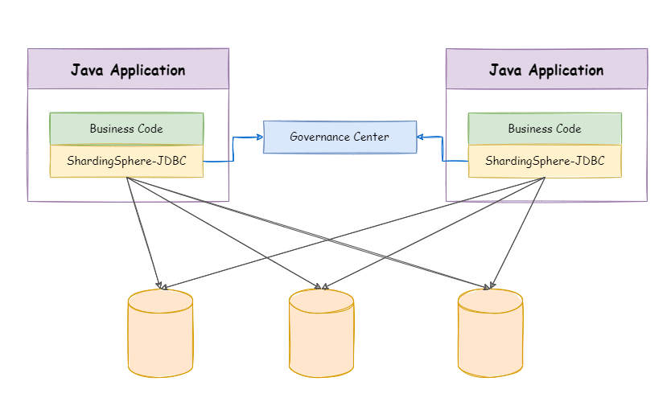

### 本资源由 itjc8.com 收集整理
# 1. ShardingSphere简介

官网：https://shardingsphere.apache.org/index_zh.html

文档：https://shardingsphere.apache.org/document/5.1.1/cn/overview/

Apache ShardingSphere 由 JDBC、Proxy 和 Sidecar（规划中）这 3 款既能够独立部署，又支持混合部署配合使用的产品组成。 

## 1.1 ShardingSphere-JDBC

**程序代码封装**

定位为轻量级 Java 框架，`在 Java 的 JDBC 层提供的额外服务`。 它使用客户端直连数据库，`以 jar 包形式提供服务`，无需额外部署和依赖，可理解为增强版的 JDBC 驱动，完全兼容 JDBC 和各种 ORM 框架。



## 1.2 ShardingSphere-Proxy

**中间件封装**

定位为透明化的`数据库代理端`，提供封装了数据库二进制协议的服务端版本，用于完成对异构语言的支持。 目前提供 MySQL 和 PostgreSQL版本，它可以使用任何兼容 MySQL/PostgreSQL 协议的访问客户端（如：MySQL Command Client, MySQL Workbench, Navicat 等）操作数据，对 DBA 更加友好。


# 2. ShardingSphere-JDBC读写分离

基于之前搭建的mysql主从读写分离使用ShardingSphere-JDBC实现读写分离

## 2.1 创建SpringBoot程序

### 2.1.1 创建springboot项目

项目名：sharding-jdbc-demo

SpringBoot版本：2.3.7.RELEASE

### 2.1.2 添加依赖

```xml
<dependencies>
    <dependency>
        <groupId>org.springframework.boot</groupId>
        <artifactId>spring-boot-starter-web</artifactId>
    </dependency>
    <dependency>
        <groupId>org.apache.shardingsphere</groupId>
        <artifactId>shardingsphere-jdbc-core-spring-boot-starter</artifactId>
        <version>5.1.1</version>
    </dependency>
    <dependency>
        <groupId>mysql</groupId>
        <artifactId>mysql-connector-java</artifactId>
        <scope>runtime</scope>
    </dependency>
    <dependency>
        <groupId>com.baomidou</groupId>
        <artifactId>mybatis-plus-boot-starter</artifactId>
        <version>3.3.1</version>
    </dependency>
    <dependency>
        <groupId>org.projectlombok</groupId>
        <artifactId>lombok</artifactId>
        <optional>true</optional>
    </dependency>
    <dependency>
        <groupId>org.springframework.boot</groupId>
        <artifactId>spring-boot-starter-test</artifactId>
        <scope>test</scope>
        <exclusions>
            <exclusion>
                <groupId>org.junit.vintage</groupId>
                <artifactId>junit-vintage-engine</artifactId>
            </exclusion>
        </exclusions>
    </dependency>
</dependencies>
```

### 2.1.3 创建 实体类

```java
package com.atguigu.shardingjdbcdemo.entity;

@TableName("t_user")
@Data
public class User {
    @TableId(type = IdType.AUTO)
    private Long id;
    private String uname;
}
```

### 2.1.4 创建Mapper

```java
package com.atguigu.shardingjdbcdemo.mapper;

@Mapper
public interface UserMapper extends BaseMapper<User> {
}
```

### 2.1.5 配置读写分离

application.properties：

```properties
# 应用名称
spring.application.name=sharding-jdbc-demo
# 环境设置
spring.profiles.active=dev
# 配置真实数据源
spring.shardingsphere.datasource.names=master,slave1

# 配置第 1 个数据源
spring.shardingsphere.datasource.master.type=com.zaxxer.hikari.HikariDataSource
spring.shardingsphere.datasource.master.driver-class-name=com.mysql.jdbc.Driver
spring.shardingsphere.datasource.master.url=jdbc:mysql://192.168.100.201:3316/mydb
spring.shardingsphere.datasource.master.username=root
spring.shardingsphere.datasource.master.password=123456

# 配置第 2 个数据源
spring.shardingsphere.datasource.slave1.type=com.zaxxer.hikari.HikariDataSource
spring.shardingsphere.datasource.slave1.driver-class-name=com.mysql.jdbc.Driver
spring.shardingsphere.datasource.slave1.url=jdbc:mysql://192.168.100.201:3326/mydb
spring.shardingsphere.datasource.slave1.username=root
spring.shardingsphere.datasource.slave1.password=123456


# 读写分离配置
# 读写分离类型，如: Static，Dynamic
# Static：数据源在配置文件中是直接配置的
# Dynamic：数据源是由程序动态读取的
spring.shardingsphere.rules.readwrite-splitting.data-sources.myds.type=Static
# 写数据源名称
spring.shardingsphere.rules.readwrite-splitting.data-sources.myds.props.write-data-source-name=master
# 读数据源名称，多个从数据源用逗号分隔
spring.shardingsphere.rules.readwrite-splitting.data-sources.myds.props.read-data-source-names=master,slave1
# 负载均衡算法名称
spring.shardingsphere.rules.readwrite-splitting.data-sources.myds.load-balancer-name=alg_round
# 负载均衡算法配置
# 负载均衡算法类型：ROUND_ROBIN、RANDOM、WEIGHT
spring.shardingsphere.rules.readwrite-splitting.load-balancers.alg_round.type=ROUND_ROBIN
# 负载均衡算法属性配置：type=WEIGHT 的时候配置
#spring.shardingsphere.rules.readwrite-splitting.load-balancers.alg_weight.props.slave1=1
#spring.shardingsphere.rules.readwrite-splitting.load-balancers.alg_weight.props.slave2=1
# 打印SQL
spring.shardingsphere.props.sql-show=true
```

## 2、测试读写分离


```java
package com.atguigu.shardingjdbcdemo;

@SpringBootTest
class ReadwriteTest {

    @Autowired
    private UserMapper userMapper;

    /**
     * 写入数据
     */
    @Test
    public void testInsert(){
        User user = new User();
        user.setUname("taotao");
        userMapper.insert(user);
    }

    /**
     * 读数据:测试负载均衡
     */
    @Test
    public void testSelectAll(){
        List<User> users1 = userMapper.selectList(null);
        List<User> users2 = userMapper.selectList(null);//执行第二次测试负载均衡
        users1.forEach(System.out::println);
        users2.forEach(System.out::println);
    }

}
```


# 3. ShardingSphere-JDBC垂直分片

什么是数据分片？

​		**简单来说，就是指通过某种特定的条件，将我们存放在同一个数据库中的数据分散存放到多个数据库（主机）上面，以达到分散单台设备负载的效果。**

数据的切分（Sharding）根据其切分规则的类型，可以分为两种切分模式：

1. **垂直（纵向）切分**：是按照**不同的表**（或者 Schema）来切分到不同的数据库（主机）之上
2. **水平（横向）切分**：是根据表中的数据的逻辑关系，将**同一个表中的数据**按照某种条件拆分到多台数据库（主机）上面。

注意：分库分表必须是**干净的库和表**（不能有数据）

分片原则：

1. **能不切分尽量不要切分**。数据量不是很大的库或者表，尽量不要分片。
2. **尽量按照功能模块分库，避免跨库join。**

项目中可以使用ShardingSphere-JDBC加载不同库中的表进行操作

## 3.1 准备服务器

服务器规划：使用`docker`方式创建如下容器

- 主服务器：容器名`server-user`，端口`3301`

- 从服务器：容器名`server-order`，端口`3302`

  

### 3.1.1 创建server-user容器

- **step1：创建容器：**

```shell
docker run -d \
-p 3301:3306 \
-v /atguigu/server/user/conf:/etc/mysql/conf.d \
-v /atguigu/server/user/data:/var/lib/mysql \
-e MYSQL_ROOT_PASSWORD=123456 \
--name server-user \
mysql:8.0.29
```


- **step2：登录MySQL服务器：**

```shell
#进入容器：
docker exec -it server-user env LANG=C.UTF-8 /bin/bash
#进入容器内的mysql命令行
mysql -uroot -p
#修改默认密码插件
ALTER USER 'root'@'%' IDENTIFIED WITH mysql_native_password BY '123456';
```


- **step3：创建数据库：**

```sql
CREATE DATABASE db_user;
USE db_user;
CREATE TABLE t_user (
 id BIGINT AUTO_INCREMENT,
 uname VARCHAR(30),
 PRIMARY KEY (id)
);
```


### 3.1.2 创建server-order容器

- **step1：创建容器：**

```shell
docker run -d \
-p 3302:3306 \
-v /atguigu/server/order/conf:/etc/mysql/conf.d \
-v /atguigu/server/order/data:/var/lib/mysql \
-e MYSQL_ROOT_PASSWORD=123456 \
--name server-order \
mysql:8.0.29
```


- **step2：登录MySQL服务器：**

```shell
#进入容器：
docker exec -it server-order env LANG=C.UTF-8 /bin/bash
#进入容器内的mysql命令行
mysql -uroot -p
#修改默认密码插件
ALTER USER 'root'@'%' IDENTIFIED WITH mysql_native_password BY '123456';
```


- **step3：创建数据库：**

```sql
CREATE DATABASE db_order;
USE db_order;
CREATE TABLE t_order (
  id BIGINT AUTO_INCREMENT,
  order_no VARCHAR(30),
  user_id BIGINT,
  amount DECIMAL(10,2),
  PRIMARY KEY(id) 
);
```


## 3.2 程序实现

### 3.2.1 创建实体类

```java
package com.atguigu.shardingjdbcdemo.entity;

@TableName("t_order")
@Data
public class Order {
    @TableId(type = IdType.AUTO)
    private Long id;
    private String orderNo;
    private Long userId;
    private BigDecimal amount;
}
```


### 3.2.2 创建Mapper

```java
package com.atguigu.shardingjdbcdemo.mapper;

@Mapper
public interface OrderMapper extends BaseMapper<Order> {
}
```


### 3.2.3 配置垂直分片

```properties
# 应用名称
spring.application.name=sharding-jdbc-demo
# 环境设置
spring.profiles.active=dev

# 配置真实数据源
spring.shardingsphere.datasource.names=server-user,server-order

# 配置第 1 个数据源
spring.shardingsphere.datasource.server-user.type=com.zaxxer.hikari.HikariDataSource
spring.shardingsphere.datasource.server-user.driver-class-name=com.mysql.jdbc.Driver
spring.shardingsphere.datasource.server-user.url=jdbc:mysql://192.168.100.201:3301/db_user
spring.shardingsphere.datasource.server-user.username=root
spring.shardingsphere.datasource.server-user.password=123456

# 配置第 2 个数据源
spring.shardingsphere.datasource.server-order.type=com.zaxxer.hikari.HikariDataSource
spring.shardingsphere.datasource.server-order.driver-class-name=com.mysql.jdbc.Driver
spring.shardingsphere.datasource.server-order.url=jdbc:mysql://192.168.100.201:3302/db_order
spring.shardingsphere.datasource.server-order.username=root
spring.shardingsphere.datasource.server-order.password=123456

# 标准分片表配置（数据节点）
# <table-name>逻辑表名：匹配 数据源名.真实表
#spring.shardingsphere.rules.sharding.tables.<table-name>.actual-data-nodes= # 由数据源名 + 表名组成，以小数点分隔。
spring.shardingsphere.rules.sharding.tables.t_user.actual-data-nodes=server-user.t_user
spring.shardingsphere.rules.sharding.tables.t_order.actual-data-nodes=server-order.t_order
# 打印SQL
spring.shardingsphere.props.sql-show=true

```


## 3.3 测试垂直分片

```java
package com.atguigu.shardingjdbcdemo;

@SpringBootTest
public class ShardingTest {

    @Autowired
    private UserMapper userMapper;

    @Autowired
    private OrderMapper orderMapper;

    /**
     * 垂直分片：
     * user数据自动写入server-user服务器的的t_user表
     * order数据自动写入server-order服务器的的t_order表
     */
    @Test
    public void testInsert1(){
        User user = new User();
        user.setUname("helen");
        userMapper.insert(user);

        Order order = new Order();
        order.setOrderNo("ATGUIGU");
        order.setAmount(new BigDecimal(100));
        order.setUserId(user.getId());
        orderMapper.insert(order);
    }
}
```


### 常见错误


ShardingSphere-JDBC远程连接的方式默认的密码加密规则是：mysql_native_password

因此需要在服务器端修改服务器的密码加密规则，如下：

```sql
ALTER USER 'root'@'%' IDENTIFIED WITH mysql_native_password BY '123456';
```


# 4. ShardingSphere-JDBC水平分片

项目中可以使用ShardingSphere-JDBC将数据存到不同库的表中

## 4.1 准备服务器

服务器规划：使用`docker`方式创建如下容器

- 主服务器：容器名`server-order0`，端口`3310`

- 从服务器：容器名`server-order1`，端口`3311`

### 4.1.1 创建server-order0容器

- **step1：创建容器：**

```shell
docker run -d \
-p 3310:3306 \
-v /atguigu/server/order0/conf:/etc/mysql/conf.d \
-v /atguigu/server/order0/data:/var/lib/mysql \
-e MYSQL_ROOT_PASSWORD=123456 \
--name server-order0 \
mysql:8.0.29
```


- **step2：登录MySQL服务器：**

```shell
#进入容器：
docker exec -it server-order0 env LANG=C.UTF-8 /bin/bash
#进入容器内的mysql命令行
mysql -uroot -p
#修改默认密码插件
ALTER USER 'root'@'%' IDENTIFIED WITH mysql_native_password BY '123456';
```


- **step3：创建数据库：**

`注意：`水平分片的id需要在业务层实现，`不能依赖数据库的主键自增`

```sql
CREATE DATABASE db_order;
USE db_order;
CREATE TABLE t_order0 (
  id BIGINT,
  order_no VARCHAR(30),
  user_id BIGINT,
  amount DECIMAL(10,2),
  PRIMARY KEY(id) 
);
CREATE TABLE t_order1 (
  id BIGINT,
  order_no VARCHAR(30),
  user_id BIGINT,
  amount DECIMAL(10,2),
  PRIMARY KEY(id) 
);
```


### 4.1.2 创建server-order1容器

- **step1：创建容器：**

```shell
docker run -d \
-p 3311:3306 \
-v /atguigu/server/order1/conf:/etc/mysql/conf.d \
-v /atguigu/server/order1/data:/var/lib/mysql \
-e MYSQL_ROOT_PASSWORD=123456 \
--name server-order1 \
mysql:8.0.29
```


- **step2：登录MySQL服务器：**

```shell
#进入容器：
docker exec -it server-order1 env LANG=C.UTF-8 /bin/bash
#进入容器内的mysql命令行
mysql -uroot -p
#修改默认密码插件
ALTER USER 'root'@'%' IDENTIFIED WITH mysql_native_password BY '123456';
```


- **step3：创建数据库：**和server-order0相同

`注意：`水平分片的id需要在业务层实现，不能依赖数据库的主键自增

```sql
CREATE DATABASE db_order;
USE db_order;
CREATE TABLE t_order0 (
  id BIGINT,
  order_no VARCHAR(30),
  user_id BIGINT,
  amount DECIMAL(10,2),
  PRIMARY KEY(id) 
);
CREATE TABLE t_order1 (
  id BIGINT,
  order_no VARCHAR(30),
  user_id BIGINT,
  amount DECIMAL(10,2),
  PRIMARY KEY(id) 
);
```


## 4.2 程序实现

水平分片需要关注全局序列的实现，因为不能简单的使用基于数据库的主键自增。

这里有两种方案：一种是基于MyBatisPlus的id策略；一种是ShardingSphere-JDBC的全局序列配置。

### 4.2.1 修改实体类

`基于MyBatisPlus的id策略：`将Order类的id设置成如下形式

```java
@TableId(type = IdType.ASSIGN_ID)
private Long id;
```

### 4.2.2 配置全局序列

`基于ShardingSphere-JDBC的全局序列配置`：和前面的MyBatisPlus的策略二选一

```properties
# 分布式序列策略配置
# 分布式序列列名称
spring.shardingsphere.rules.sharding.tables.t_order.key-generate-strategy.column=id
# 分布式序列算法名称
spring.shardingsphere.rules.sharding.tables.t_order.key-generate-strategy.key-generator-name=alg_snowflake

# 分布式序列算法配置：<key-generate-algorithm-name> 分布式序列算法名称
spring.shardingsphere.rules.sharding.key-generators.alg_snowflake.type=SNOWFLAKE
```

### 4.2.3 配置水平分片

**分片规则：**

- order表中`id为偶数时`，数据插入对应服务器的`t_order0`，`id为奇数时`，数据插入对应服务器的`t_order1`

- order表中`user_id`为偶数时，数据插入`server-order0`，`user_id`为奇数时，数据插入`server-order1`


这样分片的好处是，同一个用户的订单数据，一定会被插入到同一台服务器上，查询一个用户的订单时效率较高

```properties
# 应用名称
spring.application.name=sharding-jdbc-demo
# 环境设置
spring.profiles.active=dev

#=======================================数据源配置
# 配置真实数据源
spring.shardingsphere.datasource.names=server-user,server-order0,server-order1

# 配置第 1 个数据源
spring.shardingsphere.datasource.server-user.type=com.zaxxer.hikari.HikariDataSource
spring.shardingsphere.datasource.server-user.driver-class-name=com.mysql.jdbc.Driver
spring.shardingsphere.datasource.server-user.url=jdbc:mysql://192.168.100.201:3301/db_user
spring.shardingsphere.datasource.server-user.username=root
spring.shardingsphere.datasource.server-user.password=123456

# 配置第 2 个数据源
spring.shardingsphere.datasource.server-order0.type=com.zaxxer.hikari.HikariDataSource
spring.shardingsphere.datasource.server-order0.driver-class-name=com.mysql.jdbc.Driver
spring.shardingsphere.datasource.server-order0.url=jdbc:mysql://192.168.100.201:3310/db_order
spring.shardingsphere.datasource.server-order0.username=root
spring.shardingsphere.datasource.server-order0.password=123456

# 配置第 3 个数据源
spring.shardingsphere.datasource.server-order1.type=com.zaxxer.hikari.HikariDataSource
spring.shardingsphere.datasource.server-order1.driver-class-name=com.mysql.jdbc.Driver
spring.shardingsphere.datasource.server-order1.url=jdbc:mysql://192.168.100.201:3311/db_order
spring.shardingsphere.datasource.server-order1.username=root
spring.shardingsphere.datasource.server-order1.password=123456


#=======================================数据节点配置
# 标准分片表配置（数据节点）
# <table-name>逻辑表名：匹配 数据源名.真实表
spring.shardingsphere.rules.sharding.tables.t_user.actual-data-nodes=server-user.t_user
spring.shardingsphere.rules.sharding.tables.t_order.actual-data-nodes=server-order$->{0..1}.t_order$->{0..1}

#=======================================t_order表分片配置
#水平分片到同一数据库
# 分片列名称
spring.shardingsphere.rules.sharding.tables.t_order.table-strategy.standard.sharding-column=id
# 分片算法名称
spring.shardingsphere.rules.sharding.tables.t_order.table-strategy.standard.sharding-algorithm-name=alg_mod

#水平分片到不同数据库
# 分片列名称
spring.shardingsphere.rules.sharding.tables.t_order.database-strategy.standard.sharding-column=user_id
# 分片算法名称
spring.shardingsphere.rules.sharding.tables.t_order.database-strategy.standard.sharding-algorithm-name=alg_mod


#=======================================分片策略配置
# 分片算法类型：<sharding-algorithm-name> 分片算法名称
spring.shardingsphere.rules.sharding.sharding-algorithms.alg_mod.type=MOD
# 分片算法属性配置
spring.shardingsphere.rules.sharding.sharding-algorithms.alg_mod.props.sharding-count=2


#=======================================分布式序列策略配置
# 分布式序列策略配置：这里MyBatisPlus的分布式id和此处的设置二选一
# 分布式序列列名称
#spring.shardingsphere.rules.sharding.tables.t_order.key-generate-strategy.column=id
# 分布式序列算法名称
#spring.shardingsphere.rules.sharding.tables.t_order.key-generate-strategy.key-generator-name=alg_snowflake
# 分布式序列算法配置：<key-generate-algorithm-name> 分布式序列算法名称
#spring.shardingsphere.rules.sharding.key-generators.alg_snowflake.type=SNOWFLAKE

# 打印SQL
spring.shardingsphere.props.sql-show=true

```


## 4.3 测试水平分片和全局序列

```java
/**
     * 水平分片：插入数据
     */
@Test
public void testInsert2(){

    //创建10个用户
    for (int i = 0; i < 10; i++) {
        User user = new User();
        user.setUname("用户" + i);
        userMapper.insert(user);

        //为每个用户生成1-5个订单
        int count = new Random().nextInt(5) + 1;
        System.out.println(" count = " + count);
        for (int j = 0; j < count; j++) {
            Order order = new Order();
            order.setOrderNo("ATGUIGU"+j);
            order.setAmount(new BigDecimal(100));
            order.setUserId(user.getId());
            orderMapper.insert(order);
        }

    }
}

/**
     * 水平分片：读所有订单数据
     */
@Test
public void testSelectAll(){
    List<Order> orders = orderMapper.selectList(null);
    orders.forEach(System.out::println);
}


/**
     * 水平分片：读某个用户的订单数据
     * 可以发现，统一用户的订单来源于同一数据库
     */
@Test
public void testSelectOrdersByUserId(){
    QueryWrapper<Order> orderQueryWrapper = new QueryWrapper<>();
    orderQueryWrapper.eq("user_id", 483L);
    List<Order> orders = orderMapper.selectList(orderQueryWrapper);
    orders.forEach(System.out::println);
}
```


# 5. ShardingSphere-JDBC绑定表

## 5.1、什么是绑定表

指分片规则一致的一组分片表。 使用绑定表进行多表关联查询时，必须使用分片键进行关联，否则会出现笛卡尔积关联或跨库关联，从而影响查询效率。 例如：`t_order` 表和 `t_order_item` 表，均按照 `order_id` 分片，并且使用 `order_id` 进行关联，则此两张表互为绑定表关系。  

例如：查询订单和它的订单项

```sql
SELECT * FROM t_order o JOIN t_order_item i ON o.order_id=i.order_id WHERE o.order_id in (10, 11);
```

在不配置绑定表关系时，假设分片键 `order_id` 将数值 10 路由至第 0 片，将数值 11 路由至第 1 片，那么路由后的 SQL 应该为 4 条，对于一台服务器上的查询来说，它们呈现为笛卡尔积：

```sql
SELECT * FROM t_order0 o JOIN t_order_item0 i ON o.order_id=i.order_id WHERE o.order_id in (10, 11);

SELECT * FROM t_order0 o JOIN t_order_item1 i ON o.order_id=i.order_id WHERE o.order_id in (10, 11);

SELECT * FROM t_order1 o JOIN t_order_item0 i ON o.order_id=i.order_id WHERE o.order_id in (10, 11);

SELECT * FROM t_order1 o JOIN t_order_item1 i ON o.order_id=i.order_id WHERE o.order_id in (10, 11);
```

在配置绑定表关系，并且使用 `order_id` 进行关联后，路由的 SQL 应该为 2 条：

```sql
SELECT * FROM t_order0 o JOIN t_order_item0 i ON o.order_id=i.order_id WHERE o.order_id in (10, 11);

SELECT * FROM t_order1 o JOIN t_order_item1 i ON o.order_id=i.order_id WHERE o.order_id in (10, 11);
```

## 5.2 创建绑定表

在`server-order0、service-order1`服务器中分别创建两张表`t_order_item0、t_order_item1`表

因为我们需要将`t_order`和`t_order_item`作为一组绑定表，因此这两个表的分片策略应该一致，

所以在`t_order_item`中我们也需要创建`order_id`和`user_id`这两个分片键

```sql
CREATE TABLE t_order_item0(
    id BIGINT AUTO_INCREMENT,
    detail VARCHAR(200),
    order_id BIGINT,
    user_id BIGINT,
    PRIMARY KEY(id)
);

CREATE TABLE t_order_item1(
    id BIGINT AUTO_INCREMENT,
    detail VARCHAR(200),
    order_id BIGINT,
    user_id BIGINT,
    PRIMARY KEY(id)
);
```

## 5.3 新增代码

### 5.3.1 创建实体类

OrderItem

```java
package com.atguigu.shardingjdbcdemo.entity;

@TableName("t_order_item")
@Data
public class OrderItem {
    @TableId(type = IdType.ASSIGN_ID)
    private Long id;
    private String detail;
    private Long orderId;
    private Long userId;
}
```

OrderItemVo

```java
package com.atguigu.shardingjdbcdemo.entity;

@Data
public class OrderItemVo {

    private Long id;
    private String detail;
    private Long orderId;
    private String orderNo;
}
```

### 5.3.2 创建Mapper

```java
package com.atguigu.shardingjdbcdemo.mapper;

@Mapper
public interface OrderItemMapper extends BaseMapper<OrderItem> {

    @Select({"SELECT i.id, i.detail, i.order_id, o.order_no",
            "FROM t_order o JOIN t_order_item i ON o.id=i.order_id",
            "WHERE o.id = #{orderId}"})
    List<OrderItemVo> selectDetailByOrderId(Long orderId);
}
```

### 5.3.3 配置绑定表

在原来水平分片配置的基础上添加如下配置：

```properties
#=======================================数据节点配置
spring.shardingsphere.rules.sharding.tables.t_order_item.actual-data-nodes=server-order$->{0..1}.t_order_item$->{0..1}


#=======================================t_order_item表分片配置
#水平分片到同一数据库
# 分片列名称
spring.shardingsphere.rules.sharding.tables.t_order_item.table-strategy.standard.sharding-column=order_id
# 分片算法名称
spring.shardingsphere.rules.sharding.tables.t_order_item.table-strategy.standard.sharding-algorithm-name=alg_mod

#水平分片到不同数据库
# 分片列名称
spring.shardingsphere.rules.sharding.tables.t_order_item.database-strategy.standard.sharding-column=user_id
# 分片算法名称
spring.shardingsphere.rules.sharding.tables.t_order_item.database-strategy.standard.sharding-algorithm-name=alg_mod


#=======================================绑定表t_order,t_order_item
# 绑定表规则列表
spring.shardingsphere.rules.sharding.binding-tables[0]=t_order,t_order_item
```


## 5.4 测试绑定表

```java
@Autowired
private OrderItemMapper orderItemMapper;

/**
     * 绑定表：插入数据
     * 可以发现统一用户的订单详情数据被插入在和订单相同的数据库中，避免跨库关联
     */
@Test
public void testInsert3(){

    Long[] orderIdList = {
        1556695688627220482L,//测试sever-order0 t_order0订单
        1556695688681746433L,//测试sever-order0 t_order1订单
        1556695688719495170L,//测试sever-order1 t_order0订单
        1556695688857907201L//测试sever-order1 t_order0订单
    };

    for (Long orderId : orderIdList) {
        Order order = orderMapper.selectById(orderId);
        OrderItem orderItem = new OrderItem();
        orderItem.setOrderId(orderId);
        orderItem.setUserId(order.getUserId());
        orderItem.setDetail("订单详情...");
        orderItemMapper.insert(orderItem);
    }
}


/**
     * 关联查询：
     * 测试后主要查看控制台的sql语句。
     * 比较配置绑定表binding-tables[0]的前后，控制台sql语句发生的变化
     * 结论：配置了绑定表后，去除了笛卡尔即查询，查询效率提升
     */
@Test
public void testSelectOrderItemVo(){

    List<OrderItemVo> orderItemVoList = orderItemMapper.selectDetailByOrderId(1556695688857907201L);
    orderItemVoList.forEach(System.out::println);
}
```


# 6. ShardingSphere-JDBC广播表

## 6.1 什么是广播表

指所有的分片数据源中都存在的表，表结构及其数据在每个数据库中均完全一致。 适用于数据量不大且需要与海量数据的表进行关联查询的场景，例如：字典表。

广播具有以下特性：

（1）插入、更新操作会实时在所有节点上执行，保持各个分片的数据一致性

（2）查询操作，只从一个节点获取

（3）可以跟任何一个表进行 JOIN 操作

## 6.2 创建广播表

在server-order0、service-order1和server-user服务器中分别创建t_dict表

```sql
CREATE TABLE t_dict(
    id BIGINT,
    order_type VARCHAR(200),
    PRIMARY KEY(id)
);
```

## 6.3 程序实现

### 6.3.1 创建实体类

```java
package com.atguigu.shardingjdbcdemo.entity;

@TableName("t_dict")
@Data
public class Dict {
    //可以使用MyBatisPlus的雪花算法
    @TableId(type = IdType.ASSIGN_ID)
    private Long id;
    private String orderType;
}
```

### 6.3.2 创建Mapper

```java
package com.atguigu.shardingjdbcdemo.mapper;

@Mapper
public interface DictMapper extends BaseMapper<Dict> {
}
```

### 6.3.3 配置广播表

```properties
# 广播表
spring.shardingsphere.rules.sharding.broadcast-tables[0]=t_dict
```

## 6.4 测试广播表

```java
@Autowired
private DictMapper dictMapper;

/**
     * 广播表：每个服务器中的t_dict同时添加了新数据
     */
@Test
public void testBroadcast(){

    Dict dict = new Dict();
    dict.setOrderType("type1");
    dictMapper.insert(dict);
}
```

