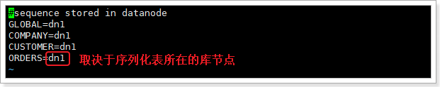

### 本资源由 itjc8.com 收集整理
# 1. 主从复制

我们一般应用对数据库而言都是“读多写少”，也就说对数据库读取数据的压力比较大，有一个思路就是采用数据库集群的方案，

其中一个是主库，负责写入数据，我们称之为：写库；

其它都是从库，负责读取数据，我们称之为：读库；

版本一致。 

那么，对我们的要求是：

1、 读库和写库的数据一致(最终一致)；

2、 写数据必须写到写库；

3、 读数据必须到读库(不一定)；

 

这里存在两个问题：

1） 如何保证读库和写库一致？

2） 如何让程序实现动态数据库切换？

 

## 1.1.   主从同步的原理

 

mysql主(master)从(slave)复制的原理：

**主库生成一个I/O线程，从库生成两个线程，一个I/O线程，一个SQL线程。**

1、 master将数据改变记录到二进制日志(binary log)中,也即是配置文件log-bin指定的文件(这些记录叫做二进制日志事件，binary log events)

2、 slave将master的binary log events拷贝到它的中继日志(relay log)

i/o线程去请求主库 的binlog，并将得到的binlog日志写到relay log（中继日志） 文件中；

主库会生成一个 log dump 线程，用来给从库 i/o线程传binlog；

3、 slave重做中继日志中的事件,将改变反映它自己的数据(数据重演)

SQL 线程，会读取relay log文件中的日志，并解析成具体操作，来实现主从的操作一致，而最终数据一致；


由此可见主从复制过程需要网络传输或大量的IO操作，这些操作会导致数据同步的**延时**


## 1.2.    检查数据库远程访问权限

准备两个虚拟机，每个都安装了mysql，并且版本一致。

**注意：使用docker搭建主从复制参考课件资料中的文档**

测试虚拟机是否可以连通宿主机的mysql服务。

在虚拟机中连接宿主机mysql服务：**mysql -uroot -proot -h172.16.116.1 -P3306**


Mysql默认是不允许远程连接的，所以，需要在之前安装的两台mysql中执行如下sql，允许远程连接：

```mysql
grant all privileges on *.* to root@'%' identified by 'root';
flush privileges;
```


再次在虚拟机中连接宿主机：成功！


## 1.3.   主从配置

每个master可以有多个slave，每个slave只属于一个master。

1、 主DB server和从DB server数据库的**版本一致**，都是5.7或者都是8

2、 主DB server和从DB server数据库**数据一致**[ 这里就会可以把主的备份在从上还原，也可以直接将主的数据目录拷贝到从的相应数据目录]

3、 **主DB server开启二进制日志**，主DB server和从DB server的**server_id都必须唯一**

**主从都配置在[mysqld]结点下，都是小写**


### 1.3.1.    master配置

把**windows**下的mysql配置成master，linux下的mysql配置成slave

找到mysql安装目录下的**my.ini**配置文件

```properties
window系统  my.ini
# 主服务器唯一ID
server-id=1
# 启用二进制日志，路径中不要有中文和空格
log-bin=D:\development_tools\mysqlserver5.7\logbin
# 可选，出错日志。出错之后可查看
log-error=D:\development_tools\mysqlserver5.7\log
# 设置不要复制的数据库
binlog-ignore-db=mysql
# 设置需要复制的数据库
binlog-do-db=mydb2
# 设置logbin格式，默认就是statement，row/mixed(5.8以上支持)
binlog_format=STATEMENT
```

```properties
centos7   vim /etc/my.cnf
# 主服务器唯一ID
server-id=1
 # 启用二进制日志，路径中不要有中文和空格
log-bin=master-bin
 # 可选，出错日志。出错之后可查看
#log-error=/opt/log
 # 设置不要复制的数据库
binlog-ignore-db=mysql
 # 设置需要复制的数据库
binlog-do-db=mydb2
 # 设置logbin格式，默认就是statement，row/mixed(5.8以上支持)  
 # statement： 此格式，日志记录的是主机数据库的写指令   默认  性能 高，但是now()之类的获取系统参数的操# 作会出现主从数据不同步的问题
 # row： 此格式，日志记录的是主机数据库的写后的数据  批量操作时性能较差  解决now()或者  user()或者  #@@hostname 等操作获取系统参数时 由于延迟导致  主从获取的参数值不同步出现的问题
 # mixed： 会按照statement保存写操作，但是now()等获取系统参数的操作会自动转为参数值保存 5.8 以后支持
binlog_format=STATEMENT

```


### 1.3.2.    slave配置

从机配置文件修改my.cnf的[mysqld]栏位下


```properties
server-id=2
# mysql中继日志
relay-log=mysql-relay
```

**因修改过配置文件，请主机+从机都重启后台mysql服务**

安全工具关上：腾讯管家  360

linux：防火墙关闭 systemctl stop firewalld


### 1.3.3.    主库创建同步用户

在主库上建立帐户并授权slave：

```mysql
# 创建slave用户
CREATE USER 'slave01'@'%' IDENTIFIED WITH 
mysql_native_password BY 'Atguigu0718.';
# 授权
GRANT REPLICATION SLAVE ON *.* TO 'slave01'@'%';
FLUSH PRIVILEGES;
```

执行SQL语句查询状态：

```mysql
SHOW MASTER STATUS
```


<font color='red'>需要记录下Position值，需要在从库中设置同步起始值。</font>

执行完此步骤后不要再操作主服务器MYSQL，防止主服务器状态值变化。


### 1.3.4.    从库配置主从关系

执行SQL：

```mysql
CHANGE MASTER TO 
 MASTER_HOST = '192.168.1.172',
 MASTER_PORT = 3306,
 MASTER_USER = 'slave01',
 MASTER_PASSWORD = '123456',
 MASTER_LOG_FILE = 'master-bin.000001',
 MASTER_LOG_POS = 156;
```

master_port：主库的ip地址

master_port：主库的端口

master_user：用户名

master_password：密码

master_log_file：上节中主库查询的file项对应的值

master_log_pos：上节中主库查询的的值

```mysql
#启动slave同步
START SLAVE;
#查看同步状态
SHOW SLAVE STATUS;
```


如果这两项为No或者Connection，均说明安装失败。

可以查看/var/log/mysqld.log日志，进行错误定位。

虚拟机主从由于克隆的是同一个mysql，所以生成的uuid一样，需要先删除从机的uuid：

```
rm -vf /var/lib/mysql/auto.cnf
```

重启mysql服务

### 1.3.5.    重置主从关系

如何停止从服务复制功能：`stop slave;`

如何重新配置主从：

```
stop slave;
reset master;
```


## 1.4.   测试主从复制

在本地电脑（master）创建要同步的mydb2（在配置文件中配置的同步库）这个库、添加了test表，并往表中添加了一些数据：


在虚拟机（slave）查看库及数据信息：


说明同步成功了。


# 2. Mycat


​		如今随着互联网的发展，数据的量级也是成指数的增长，从 GB 到 TB 到 PB。对数据的各种操作也是愈加的困难，传统的关系性数据库已经无法满足快速查询与插入数据的需求。这个时候 NoSQL 的出现暂时解决了这一危机。它通过降低数据的安全性，减少对事务的支持，减少对复杂查询的支持，来获取性能上的提升。

​		但是，在有些场合 NoSQL 一些折衷是无法满足使用场景的，就比如有些使用场景是绝对要有事务与安全指标的。这个时候 NoSQL 肯定是无法满足的，所以还是需要使用关系性数据库。如何使用关系型数据库解决海量存储的问题呢？此时就需要做数据库集群，为了提高查询性能将一个数据库的数据分散到不同的数据库中存储。


## 2.1.   Mycat简介

 

 

**MyCat支持的数据库：**

 


## 2.2.   MyCat读写分离原理

MyCat是我们的程序与MySQL数据库之间的桥梁，我们的请求不再直接到达数据库，而是到达MyCat，由MyCat决定读和写的去向。

 

也就是说：

我们的Jdbc连接是连接MyCat，程序代码没有任何变化。（在用户眼里，MyCat就是一个数据库）

MyCat中需要配置好主库从库关系，会根据请求的判断读写，实现读写分离。


## 2.3.   不废话，动手试试

### 2.3.1.    安装

mycat不需要安装，解压即可使用。把课前资料中的《Mycat-server-1.6.7.6-release-20220524173810-linux.tar.gz》上传到/opt目录下，解压获得mycat：


打开mycat目录结构如下：


bin：二进制执行文件

**conf：配置文件目录**

lib：依赖

logs：日志

conf配置目录下有很多配置文件：


其中核心的配置有3个：

​    server.xml：配置MyCat作为虚拟数据库的信息（地址、数据库名、用户名、密码等信息）

​    schemal.xml：mycat代理的真实数据库的信息，实现读写分离

​    rule.xml：分库分表规则配置


### 2.3.2.   server.xml配置

server.xml中是MyCat作为虚拟数据库的基本信息。

 

这里随便配置了虚拟机库：TESTDB

**mycat的默认端口是：8066**


### 2.3.3.    配置schema.xml

配置虚拟库（TESTDB）和真实数据库（mydb2）的映射信息，实现读写分离：

```xml
<?xml version="1.0"?>
<!DOCTYPE mycat:schema SYSTEM "schema.dtd">
<mycat:schema xmlns:mycat="http://io.mycat/">
	
	<!-- 虚拟库与真实库的映射 
		name="TESTDB" 虚拟库的名字，对应刚刚在server.xml中设置的TESTDB
		sqlMaxLimit="100"，允许最大查询记录数
		checkSQLschema="false" 是否检查自动删除 “虚拟库名”
		randomDataNode="dn1" 虚拟库对应的真实database，值为dataNode标签的name
	-->
	<schema name="TESTDB" checkSQLschema="false" sqlMaxLimit="100" randomDataNode="dn1">
		<!-- 可以访问的表，只有设置在这里的表才会被MyCat管理访问 
			dataNode:虚拟库对应的真实database，对应<dataNode>标签。如果做分片，则配置多个，用逗号分隔；或者使用db$0-99，代表db0到db99的database
			rule：分片规则，如果没有则删除
		-->
		<!-- <table name="tb_item" dataNode="dn1"/> -->
	</schema>
	<!-- 真实的database信息，每一个dataNode就是一个数据库分片
		name：虚拟名称
		dataHost：真实库的主机信息，对应<dataHost>标签
		database：真实database名称
	-->
	<dataNode name="dn1" dataHost="localhost1" database="mydb2" />
	
	<!-- 真实库的主机信息
		name：主机名
		maxCon：最大连接， minCon：最小连接
		balance：负载均衡方式：0~3四种选项。0，不开启读写分离。1~3都开启，区别是主是否参与读
		writeType：写负载均衡。永远设置0
		dbDriver：驱动类型，推荐native，可选jdbc
		switchType：主从的自动切换
	-->
	<dataHost name="localhost1" maxCon="1000" minCon="10" balance="1"
			  writeType="0" dbType="mysql" dbDriver="native" switchType="1">
		<heartbeat>select user()</heartbeat>
		<!-- can have multi write hosts -->
		<writeHost host="hostM1" url="172.16.116.1:3306" user="root"
				   password="root">
			<!-- can have multi read hosts -->
			<readHost host="hostS2" url="172.16.116.110:3306" user="root" password="root" />
		</writeHost>
	</dataHost>
</mycat:schema>

```


### 2.3.4.    启动mycat

进入 mycat/bin目录：

启动： ./mycat start

控制台启动： ./mycat console

停止： ./mycat stop

重启： ./mycat restart

状态： ./mycat status

日志文件：mycat/logs/wrapper.log

### 2.3.5.    测试连接mycat

mycat的使用方式跟mysql一模一样。

本地连接：（虚拟机）

```
mysql -uroot -p123456 -h172.16.116.110 -P8066
```


宿主机通过navicat连接mycat：

 

连接成功后：


### 2.3.6.    在项目中使用

其实项目中，只要改一个地方即可，就是jdbc的连接参数。

 

mycat中的，一旦你给sql加了事务，走主库。


## 2.4.   读写分离

在schema.xml中配置读写分离：


负载均衡类型，目前的取值有4 种：

1. balance="0", 不开启读写分离机制，所有读操作都发送到当前可用的 writeHost 上。
2. balance="1"，全部的 readHost 与 stand by writeHost 参与 select 语句的负载均衡，简单的说，当双主双从模式(M1->S1，M2->S2，并且 M1 与 M2 互为主备)，正常情况下，M2,S1,S2 都参与 select 语句的负载均衡。
3. balance="2"，所有读操作都随机的在 writeHost、readhost 上分发。
4. balance="3"，所有读请求随机的分发到 readhost 执行，writerHost 不负担读压力


往test表中新增一条数据：

```sql
INSERT INTO test(name, age) values(@@hostname, 30);
```

@@hostname：计算机名。

​	例如我这里宿主机的计算机名是：LAPTOP-M3RC4R1J；虚拟机名：joedy

上述sql执行成功后。

在mycat中执行查询看看结果：

 

在宿主机的mysql中查询：

 

在虚拟机的mysql中查询

 


思考：为什么结果不同？


## 2.5.   mycat数据分片

什么是数据分片？

​		**简单来说，就是指通过某种特定的条件，将我们存放在同一个数据库中的数据分散存放到多个数据库（主机）上面，以达到分散单台设备负载的效果。**


数据的切分（Sharding）根据其切分规则的类型，可以分为两种切分模式：

1. **垂直（纵向）切分**：是按照**不同的表**（或者 Schema）来切分到不同的数据库（主机）之上
2. **水平（横向）切分**：是根据表中的数据的逻辑关系，将**同一个表中的数据**按照某种条件拆分到多台数据库（主机）上面。


垂直切分：

 

水平切分：

 


### 2.5.1.    mycat分片原理

MyCat的分片实现：

 

**逻辑库(schema) ：**MyCat作为一个数据库中间件，起到一个程序与数据库的桥梁作用。开发人员无需知道MyCat的存在，只需要知道数据库的概念即可。为了让MyCat更透明，它会把自己“伪装”成一个MySQL数据库，因此需要有一个虚拟的 database，在MyCat中也叫逻辑库，英文就是schema。

**逻辑表（table）：**既然有逻辑库，那么就会有逻辑表，分布式数据库中，对应用来说，读写数据的表就是逻辑表。逻辑表，可以是数据切分后，分布在一个或多个分片库中，也可以不做数据切分，不分片，只有一个表构成。

**分片节点(dataNode)：**数据切分后，一个大表被分到不同的分片数据库上面，每个表分片所在的数据库就是分片节点（dataNode）。

**节点主机(dataHost)：**数据切分后，每个分片节点（dataNode）不一定都会独占一台机器，同一机器上面可以有多个分片数据库，这样一个或多个分片节点（dataNode）所在的机器就是节点主机（dataHost）,为了规避单节点主机并发数限制，尽量将读写压力高的分片节点（dataNode）均衡的放在不同的节点主机（dataHost）。

**分片规则(rule)：**前面讲了数据切分，一个大表被分成若干个分片表，就需要一定的规则，这样按照某种业务规则把数据分到某个分片的规则就是分片规则，数据切分选择合适的分片规则非常重要，将极大的避免后续数据处理的难度。


### 2.5.2.    分片分析

注意：分库分表必须是干净的库和表（不能有数据）

分片原则：

1. **能不切分尽量不要切分**。数据量不是很大的库或者表，尽量不要分片。
2. **尽量按照功能模块分库，避免跨库join。**

```mysql
#客户表  rows:20万 
CREATE TABLE customer(
    id INT AUTO_INCREMENT,
    NAME VARCHAR(200),
    PRIMARY KEY(id)
);
 
 
#订单表   rows:600万
CREATE TABLE orders(
    id INT AUTO_INCREMENT,
    order_type INT,
    customer_id INT,
    amount DECIMAL(10,2),
    PRIMARY KEY(id)  
); 
 
 
#订单详细表     rows:600万
CREATE TABLE orders_detail(
    id INT AUTO_INCREMENT,
    detail VARCHAR(2000),
    order_id INT,
    PRIMARY KEY(id)
);
 
 
#订单状态字典表   rows:20
CREATE TABLE dict_order_type(
    id INT AUTO_INCREMENT,
    order_type VARCHAR(200),
    PRIMARY KEY(id)
);
```

分库：宿主机mysql服务上添加order库：存放order相关的表；虚拟机mysql上添加user库存存放customer表

### 2.5.3.    分库实现

分两步实现：

1. 分别在宿主机和虚拟机mysql上创建两个库，并创建相应的表
2. 配置schema.xml实现mycat分库


第一步建库建表：

 

第二步配置schema.xml：由于咱们只有两台服务，所以这里都没有配置读库，只配置写库


具体内容如下：

```xml
<?xml version="1.0"?>
<!DOCTYPE mycat:schema SYSTEM "schema.dtd">
<mycat:schema xmlns:mycat="http://io.mycat/">

        <schema name="TESTDB" checkSQLschema="false" sqlMaxLimit="100" dataNode="dn1">
                <table name="customer" dataNode="dn2"/>
        </schema>
        <dataNode name="dn1" dataHost="localhost1" database="order" />
        <dataNode name="dn2" dataHost="localhost2" database="user" />
        <dataHost name="localhost1" maxCon="1000" minCon="10" balance="0"
                          writeType="0" dbType="mysql" dbDriver="native" switchType="1"  slaveThreshold="100">
                <heartbeat>select user()</heartbeat>
                <!-- can have multi write hosts -->
                <writeHost host="hostM1" url="172.16.116.1:3306" user="root"
                                   password="root">
                </writeHost>
        </dataHost>
        <dataHost name="localhost2" maxCon="1000" minCon="10" balance="0"
                          writeType="0" dbType="mysql" dbDriver="native" switchType="1"  slaveThreshold="100">
                <heartbeat>select user()</heartbeat>
                <!-- can have multi write hosts -->
                <writeHost host="hostM2" url="172.16.116.110:3306" user="root"
                                   password="root">
                </writeHost>
        </dataHost>
</mycat:schema>
```


**重启mycat服务**，后查看mycat中的表：


**注意：由于navicat对mycat的兼容性问题，在navicat，sqlyog等数据库客户端，看到的表可能不完整**

 


### 2.5.4.    分表实现

接下来以order表做分表演示。先停止mycat服务：./mycat stop

1. 首先在rule.xml中配置分表规则

```xml
<tableRule name="order_rule">
    <rule>
        <columns>customer_id</columns>
        <algorithm>mod-long</algorithm>
    </rule>
</tableRule>
<function name="mod-long" class="io.mycat.route.function.PartitionByMod">
    <!-- how many data nodes -->
    <property name="count">2</property>
</function>
```

2. 在schema.xml中配置使用分表规则


3. 手动在虚拟机（dn2）上的mysql服务中创建orders表。

 


最后启动mycat。往mycat中插入几条数据：

```mysql
INSERT INTO orders(id,order_type,customer_id,amount) VALUES(1,101,100,100100);
INSERT INTO orders(id,order_type,customer_id,amount) VALUES(2,101,100,100300);
INSERT INTO orders(id,order_type,customer_id,amount) VALUES(3,101,101,120000);
INSERT INTO orders(id,order_type,customer_id,amount) VALUES(4,101,101,103000);
INSERT INTO orders(id,order_type,customer_id,amount) VALUES(5,102,101,100400);
INSERT INTO orders(id,order_type,customer_id,amount) VALUES(6,102,100,100020);
INSERT INTO orders(id,order_type,customer_id,amount) VALUES(7,102,102,100050);
INSERT INTO orders(id,order_type,customer_id,amount) VALUES(8,102,103,100060);
INSERT INTO orders(id,order_type,customer_id,amount) VALUES(9,102,103,100070);
```

**注意：使用mycat分表之后orders后的字段名不能省略！！！**

在mycat中查询：

 

在宿主机mysql中查询：

 

在虚拟机mysql中查询：

 


思考：orders_detail怎么分表？


### 2.5.5.    跨库join

往orders_detail导入几条数据：

```mysql
INSERT INTO orders_detail(id,detail,order_id) VALUES(1,'detail1',1);
INSERT INTO orders_detail(id,detail,order_id) VALUES(2,'detail1',2);
INSERT INTO orders_detail(id,detail,order_id) VALUES(3,'detail1',3);
INSERT INTO orders_detail(id,detail,order_id) VALUES(4,'detail1',4);
INSERT INTO orders_detail(id,detail,order_id) VALUES(5,'detail1',5);
INSERT INTO orders_detail(id,detail,order_id) VALUES(6,'detail1',6);
```

执行join查询：

```mysql
SELECT * FROM orders o INNER JOIN orders_detail od ON od.order_id=o.id;
```


报错，这是由于虚拟机mysql库中没有orders_detail这个表，所以关联时，找不到。


解决方案：**把orders_detail也相应分表到相应的mysql服务**

orders_detail分表步骤：首先停掉mycat服务

1. 删除刚刚导入的orders_detail数据。分表必须在库和表干净的情况下完成
2. 在schema.xml中添加orders_detail表的配置
3. 在虚拟机mysql上创建orders_detail表


1. 删除orders_detail数据，在宿主机mysql中执行：

```mysql
delete from orders_detail;
```

2. 修改schema.xml配置，添加orders_detail表的配置：


完整的schema.xml配置如下：

```xml
<?xml version="1.0"?>
<!DOCTYPE mycat:schema SYSTEM "schema.dtd">
<mycat:schema xmlns:mycat="http://io.mycat/">

        <schema name="TESTDB" checkSQLschema="false" sqlMaxLimit="100" dataNode="dn1">
                <table name="customer" dataNode="dn2"/>
                <table name="orders" dataNode="dn1,dn2" rule="order_rule"
                       fetchStoreNodeByJdbc="true">
                    	<!--name: 定义子表的表名；primaryKey：字表的主键；joinKey：与父表建立关联关系的列名；parentKey：父表的主键名-->
                        <childTable name="orders_detail" primaryKey="id" joinKey="order_id" parentKey="id" />
                </table>
        </schema>
        <dataNode name="dn1" dataHost="localhost1" database="order" />
        <dataNode name="dn2" dataHost="localhost2" database="user" />
        <dataHost name="localhost1" maxCon="1000" minCon="10" balance="0"
                          writeType="0" dbType="mysql" dbDriver="native" switchType="1"  slaveThreshold="100">
                <heartbeat>select user()</heartbeat>
                <!-- can have multi write hosts -->
                <writeHost host="hostM1" url="172.16.116.1:3306" user="root"
                                   password="root">
                </writeHost>
        </dataHost>
        <dataHost name="localhost2" maxCon="1000" minCon="10" balance="0"
                          writeType="0" dbType="mysql" dbDriver="native" switchType="1"  slaveThreshold="100">
                <heartbeat>select user()</heartbeat>
                <!-- can have multi write hosts -->
                <writeHost host="hostM2" url="172.16.116.110:3306" user="root"
                                   password="root">
                </writeHost>
        </dataHost>
</mycat:schema>
```


3. 在虚拟机mysql上创建orders_detail表

 


重启mycat，再次在mycat中导入orders_detail表数据，并查询测试：

 


### 2.5.6.    全局表

最后，dict_order_type字典表怎么办？**设定为全局表**

**设定为全局的表，会直接复制给每个数据库一份，所有写操作也会同步给多个库。**

所以全局表一般不能是大数据表或者更新频繁的表。一般是字典表或者系统表为宜。


停掉mycat服务。

1. 在虚拟机mysql中创建字典表：

 

2. 修改schema.xml配置：


```xml
<table name="dict_order_type" dataNode="dn1,dn2" type="global" ></table>
```


启动mycat，往字典表中插入数据：

```mysql
INSERT INTO dict_order_type(id,order_type) VALUES(101,'type1');
INSERT INTO dict_order_type(id,order_type) VALUES(102,'type2');
```


## 2.6.   全局ID序列

在分库分表环境下，表的主键该怎么设计？

如果自增长必然会导致两张表数据id重复。那怎么办？

Mycat提供了多种解决方案：

1. 本地文件方式。不推荐 io
2. 数据库方式. [通过一个库的一张表维护自增长的id  ]
3. 本地时间戳方式。18位时间戳(毫秒内并发的请求id可能冲突)
4. 分布式 ZooKeeper ID 生成器
5. redis 递增方式

等等。这里使用数据库方式


### 2.6.1.    数据库序列方式原理(了解)

**利用数据库一个表 来进行计数累加。**

但是并不是每次生成序列都读写数据库，这样效率太低

**mycat会预加载一部分号段到mycat的内存中，这样大部分读写序列都是在内存中完成的。**
**如果内存中的号段用完了 mycat会再向数据库要一次。**

问：**那如果mycat崩溃了 ，那内存中的序列岂不是都没了？**
是的。如果是这样，那么mycat启动后会向数据库申请新的号段，原有号段会弃用。
也就是说如果mycat重启，那么损失是当前的号段没用完的号码，但是不会因此出现主键重复。


### 2.6.2.    建库序列脚本

以下脚本来自官方：在**宿主机**mysql上执行

```mysql
# 创建序列表
CREATE TABLE MYCAT_SEQUENCE (NAME VARCHAR(50) NOT NULL,current_value INT NOT
NULL,increment INT NOT NULL DEFAULT 100, PRIMARY KEY(NAME)) ENGINE=INNODB;

## 创建相关 function
# 获取当前sequence的值 (返回当前值,增量)
DELIMITER $$
CREATE FUNCTION mycat_seq_currval(seq_name VARCHAR(50)) RETURNS VARCHAR(64)
DETERMINISTIC  
BEGIN
DECLARE retval VARCHAR(64);
SET retval="-999999999,null";
SELECT CONCAT(CAST(current_value AS CHAR),",",CAST(increment AS CHAR)) INTO retval FROM
MYCAT_SEQUENCE WHERE NAME = seq_name;
RETURN retval;
END $$
DELIMITER;
# 设置sequence值
DELIMITER $$
CREATE FUNCTION mycat_seq_setval(seq_name VARCHAR(50),VALUE INTEGER) RETURNS VARCHAR(64)
DETERMINISTIC
BEGIN
UPDATE MYCAT_SEQUENCE
SET current_value = VALUE
WHERE NAME = seq_name;
RETURN mycat_seq_currval(seq_name);
END $$
DELIMITER ;
# 获取下一个sequence值
DELIMITER $$
CREATE FUNCTION mycat_seq_nextval(seq_name VARCHAR(50)) RETURNS VARCHAR(64) 
DETERMINISTIC
BEGIN
UPDATE MYCAT_SEQUENCE
SET current_value = current_value + increment WHERE NAME = seq_name;
RETURN mycat_seq_currval(seq_name);
END $$
DELIMITER;

## 初始化序列表数据
INSERT INTO MYCAT_SEQUENCE(NAME,current_value,increment) VALUES ('ORDERS', 400000,
100);
```

注意：MYCAT_SEQUENCE 表和以上的 3 个 function，需要放在同一个节点上。function 请直接在具体节
点的数据库上执行，如果执行的时候报：

you might want to use the less safe log_bin_trust_function_creators variable

需要对数据库做如下设置：

windows 下 my.ini[mysqld]加上 log_bin_trust_function_creators=1

linux 下/etc/my.cnf 下 my.ini[mysqld]加上 log_bin_trust_function_creators=1

修改完后，即可在 mysql 数据库中执行上面的函数.

执行成功：

 


### 2.6.3.    sequence_db_conf.properties 配置

sequence_db_conf.properties 相关配置，指定 sequence 相关配置在哪个节点上：


配置内容：vim sequence_db_conf.properties

 


### 2.6.4.    server.xml配置

vim server.xml：


### 2.6.5.    重启测试

在mycat中执行以下sql，插入记录：

```mysql
insert into `orders`(id,amount,customer_id,order_type) values(next value for MYCATSEQ_ORDERS,1000,101,102);
```

next value for MYCATSEQ_ORDERS：从mycat序列表中获取Id

执行两次之后：

 

mycat宕机重启后，验证id是否重复

 


### 2.6.6.    自主生成id

除了上述mycat提供的id生成方案外，也可以通过在程序中生成唯一id：

1. uuid （不推荐）

2. 可以利用 redis的单线程原子性 incr来生成序列

3. Twitter的雪花算法

   雪花算法：使用19位长度的十进制的数字当做id

   ​						使用当前的时间戳+当前服务器的机器码+毫秒内的id序号

   ​					一共得到一个64bit的数据，高位表示符号位 一般是0，后面的63bit组成了生成id

   ​		

   ​		按照时间递增有序，全局唯一，十进制的数字
