[TOC]

command+option+s 生成构造函数 getter

sudo /usr/sbin/apachectl restart

#### idea快捷键

查看接口实现类 **Command** + **Option** +左键

查看类的继承关系 **Control** + **H** 

生成器 **Command** + **N** 

**SHIFT** + **F6** 修改文件名

**Command** +  **Option** + v 生成类型变量


JDBCTools.class.getClassLoader().getResourceAsStream("druid.properties");


[博客](https://www.cnblogs.com/tanghaorong/p/12377110.html#_label1)


//TODO

```java
AtomicReference
```


#### 一.this本质


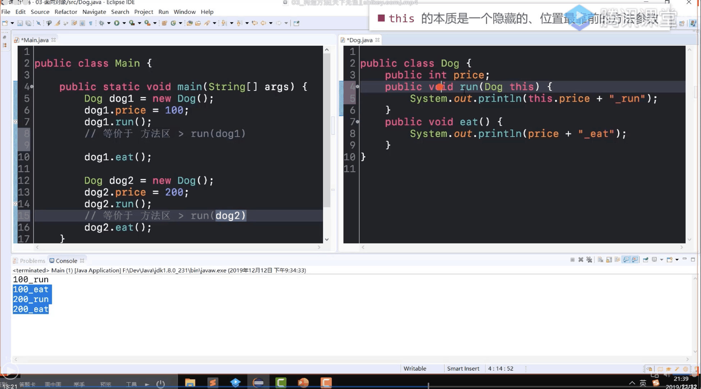

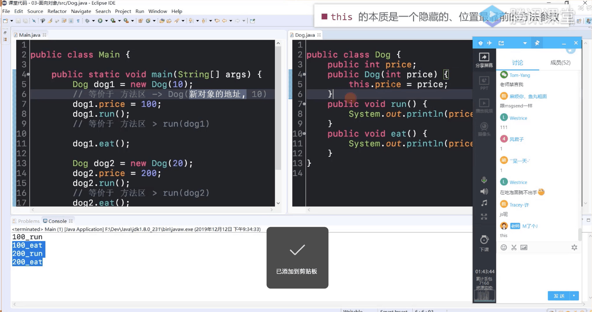

调用方法时,第一个参数(隐藏)是当前对象赋值给this;
创建对象时,第一个参数(隐藏)是新对象地址值;

#### 二.权限

- 只有public,无修饰符可以修饰顶级类;
- 一个文件只有一个public类 与文件名相同

#### 三.构造方法

- 如果一个类没有自定义构造方法，编译器会自动为它提供<font color=red><strong >无参</strong ></font>的默认构造方法

#### 四.static

- 在<font color=red><strong>同一个类</strong></font>中,不能有同名的实例变量和类变量，不能有相同签名的实例方法和类方法

#### 五.变量

- 成员变量初始化会有默认值,局部变量没有默认值

#### 六.嵌套类


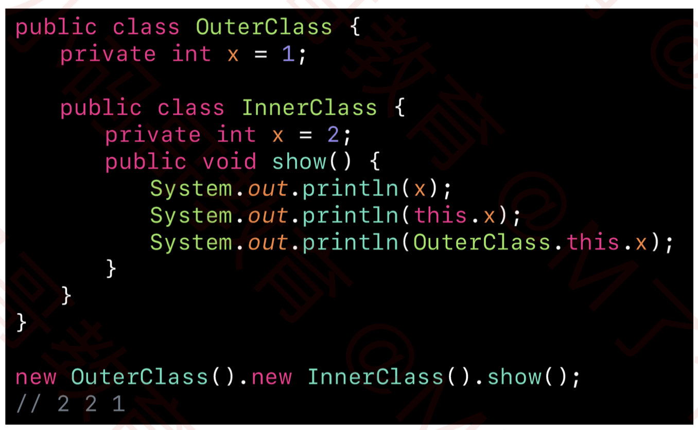

访问外部类属性

- 内部类(没有被 static 修饰的嵌套类，非静态嵌套类)&局部类&匿名类不能定义除编译时常量以外的任何 static 成员(编译时常量替换)

- 匿名类&内部类中this.属性是当前类中的属性,省略this向上查找

- 局部内部类是定义在函数的内部,不可以用访问修饰符修饰,只能在函数内部使用,随着函数的调用而使用,只能在该函数中实例化对象,和局部变量差不多

- 静态嵌套类无需引入包，通过外部类访问，内部类通过包引入，通过父类实例创建实例

- 局部类只能访问 final 或者 有效 final 的局部变量

  从 Java 8 开始，如果局部变量没有被第二次赋值，就认定为是有效 final(局部变量没有第二次赋值)


#### 七.abstract

- 子类必须实现抽象父类中的所有抽象方法（除非子类也是一个抽象类）
- 抽象类可以定义非抽象方法,并添加实现过程
- 接口作为类型 实参必须实现接口
- 接口只有常量抽象方法嵌套类型(可以省略)

#### 八.接口

- 接口静态方法不能被继承，通过接口名调用
- 默认方法细节


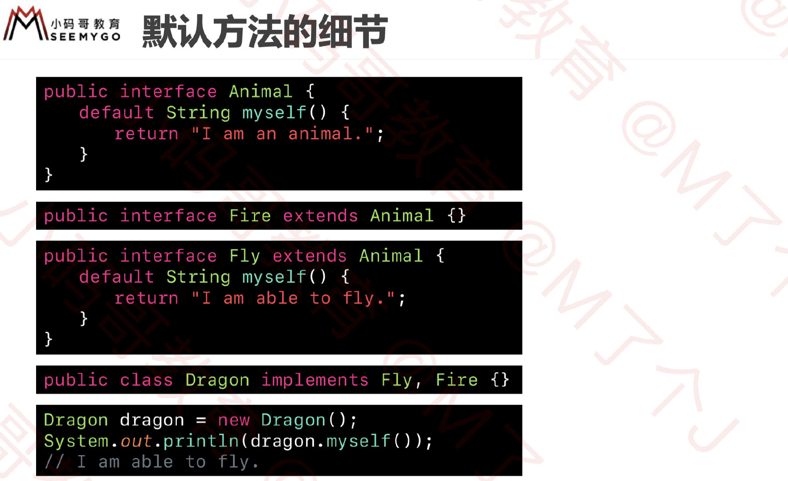

默认方法 就近原则

#### 八.重写,覆盖

- 重写规则(1.子类 override 的方法权限必须 ≥ 父类的方法权限2.假设子类 override 的方法返回值类型是 A，父类的方法返回值类型是 B,那么 A == B 或者 A 是 B 的子类型.必须是类)
- 类方法(静态方法)调用细节 覆盖属于实例方法


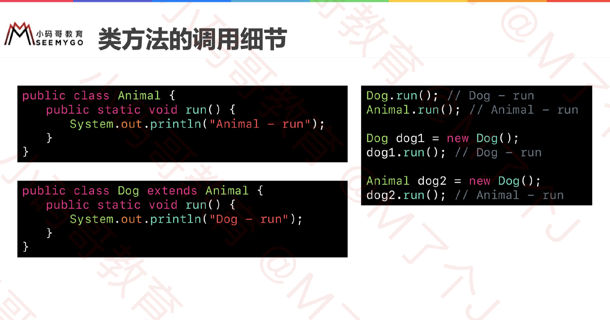


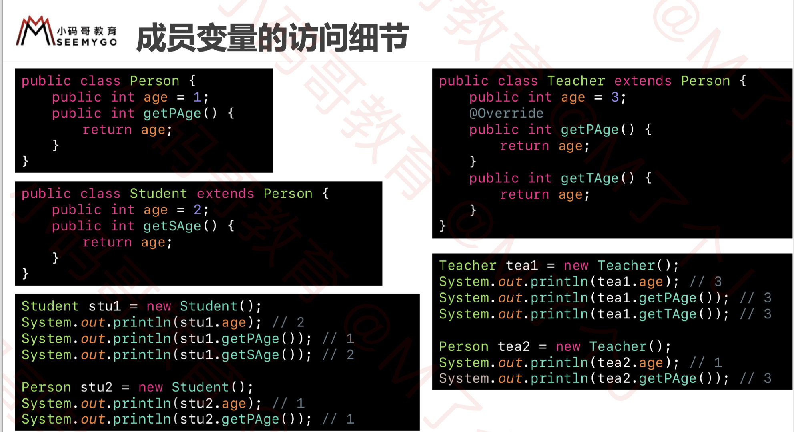

<font color="red">子类实例调用方法 若父类没有对应方法则报错 若子类与父类有相同方法(重写) 调用子类方法,(父类方法中调用子类重写方法),静态方法和成员变量根据对应的类去找(就近原则)</font>

```java
class Person1{
	void test(int a){
		System.out.println(666);
		test1();//子类方法
	}
	void test1(){
		System.out.println("person");
	}
}
class Student extends Person1{
	void test(int a,int b){
		
	}
	void test1(){
		System.out.println("Student");
	}
}
Student s=new Student();
s.test(2);
```


#### 九.方法引用(lambda)


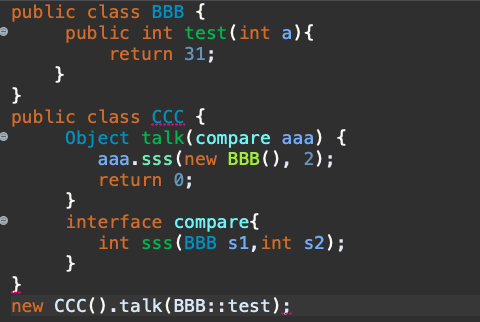

引用特定类型的任意对象的实例方法

#### 10.数字


小数精确计算 new BigDecimal(String)


IntegerCache 类中缓存了 [-128, 127] 范围的 Integer 对象 Integer.valueOf 方法会优先去 IntegerCache 缓存中获取 Integer 对象

#### 11.类型转换


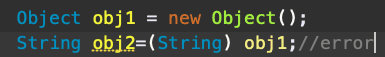

#### 12.集合


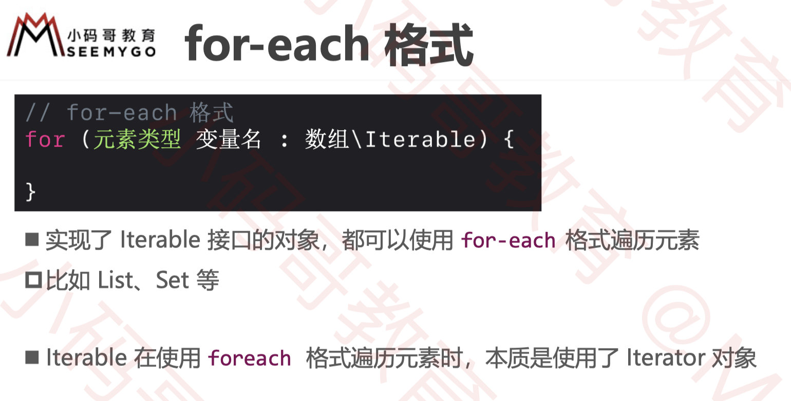

使用迭代器、forEach 遍历集合元素时，若使用了集合自带的方法修改集合的长度（比如 add、remove 等方法） 那么会抛出 java.util.ConcurrentModificationException 异常


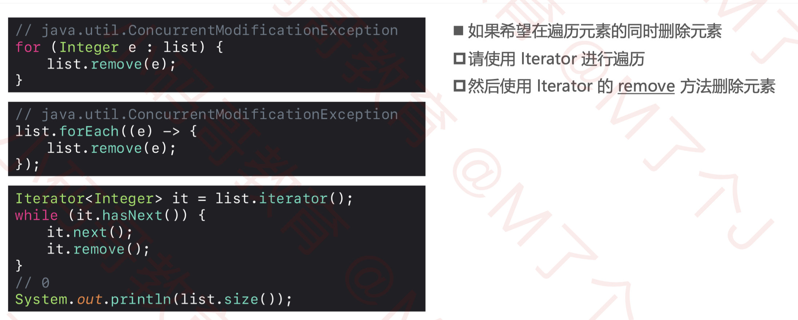

判断是偶数 number & 1==0 (效率高于number%2==0)

#### 13.泛型


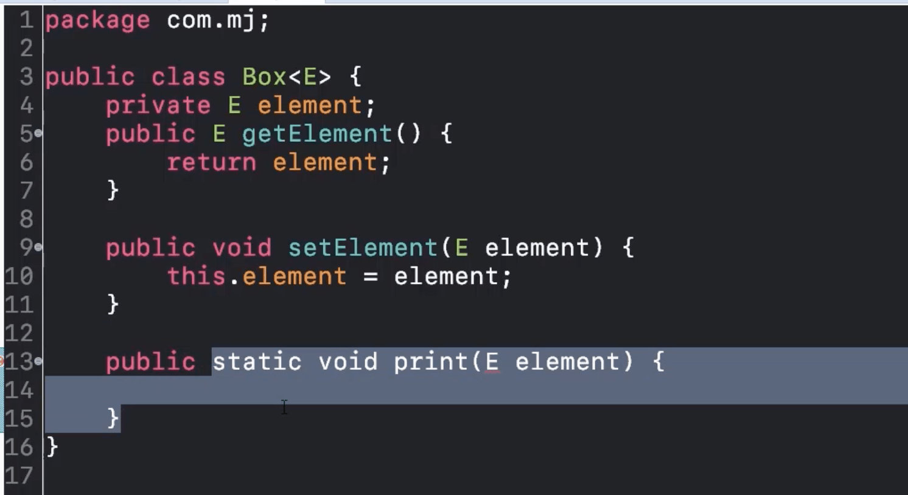

泛型类型只能用于实例方法以及构造方法(Box<Integer> box=new Box<>())

[泛型和数组](https://www.cnblogs.com/weststar/p/12614253.html)

[泛型和数组](https://lanlan2017.github.io/JavaReadingNotes/fae3fa2/)

泛型设计及的一个原则——如果一段代码在编译时没有提出“unchecked未经检查的转换”的警告，则程序在运行时不会引发ClassCastException异常。正是基于这个原因，所以数组元素的类型不能包含泛型变量、泛型形参，除非时无上限的类型通配符。但可以声明元素类型包含泛型变量或泛型形参的数组。也就是说List<String>[]数组，但不能创建ArrayList<String>[10]这样的数组。


因为Java的范型会在编译后将类型信息抹掉，这样如果Java允许我们使用类似

```java
Map<Integer, String>[] mapArray = new Map<Integer, String>[20];
```

这样的语句的话，我们在随后的代码中可以把它转型为Object[]然后往里面放Map<Double, String>实例。这样做不但编译器不能发现类型错误，就连运行时的数组存储检查对它也无能为力，它能看到的是我们往里面放Map的对象，我们定义的<Integer, String>在这个时候已经被抹掉了，于是而对它而言，只要是Map，都是合法的。想想看，我们本来定义的是装Map<Integer, String>的数组，结果我们却可以往里面放任何Map，接下来如果有代码试图按原有的定义去取值，后果是什么不言自明。

[[Java 泛型总结（三）：通配符的使用](https://segmentfault.com/a/1190000005337789)](https://segmentfault.com/a/1190000005337789)


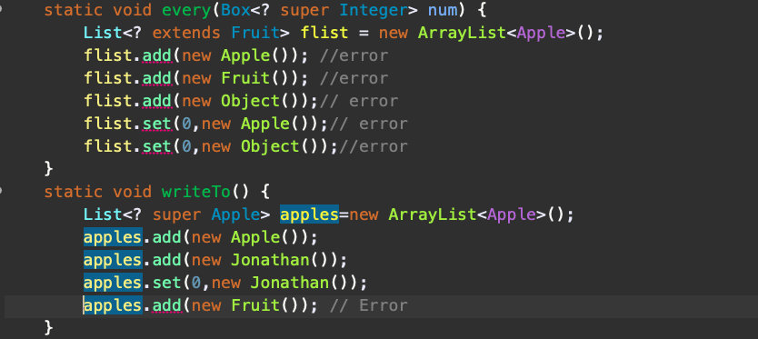


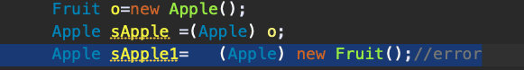

Char  需要单引号 单个字符


测试数字是偶数 num&1==0

10>>1==10/2

10<<1==10*2

局部变量需要手动初始化


常量 成员常量需手动赋值（代码块，构造函数）局部常量可以先定义再赋值一次

父类，接口方法签名相同时 返回值子类类型小于父类，接口方法（同继承）


子类调用父类super 内部类调用外部类 类名.this.

[关于 Java 字符串拼接的几种方式以及性能比较](https://www.jianshu.com/p/0245bbd977eb)


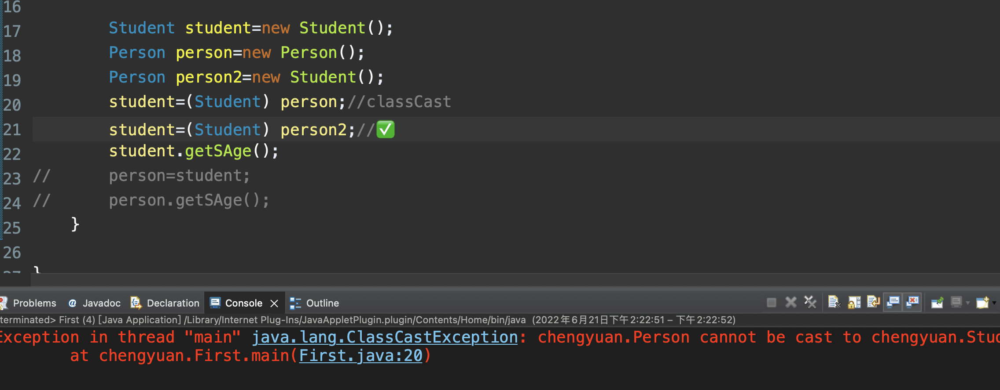


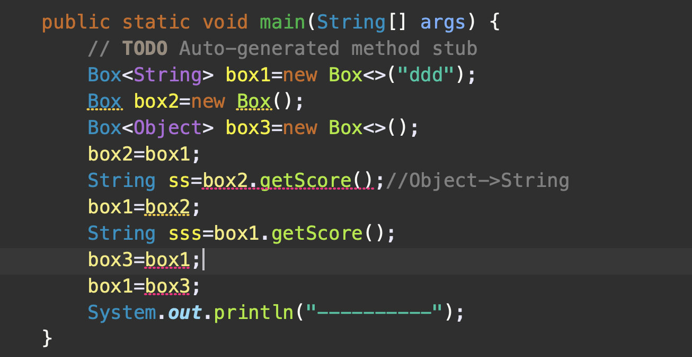


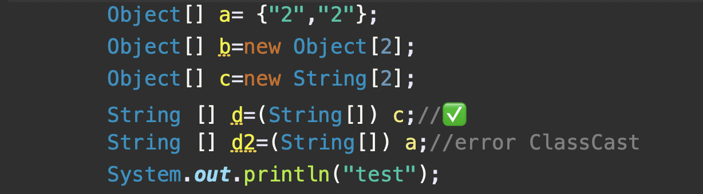

[类型擦除](https://www.cnblogs.com/weststar/p/12613412.html)

[Java 为什么不支持泛型数组？](https://developer.aliyun.com/article/896292)

[Java泛型的协变与逆变](https://juejin.cn/post/6911302681583681544)

[泛型擦除 反射验证](https://cloud.tencent.com/developer/article/1609343)

```java
List<String>[] list = (LinkedList<String>[]) new LinkedList[10];
list[0] = new LinkedList<String>();
list[1] = new LinkedList<Integer>();// 报错
```

```java
	static void foo(List<?> list) {
		foo2(list);
	}
	static <T> void foo2(List<T> list) {
		
	}
```

```java
	static <T> void showBox4(T box) {
		List<?> list=new ArrayList<>();
		List<T> list2=new ArrayList<>();
		list2=list;//error
		list =list2;
	}
```

```java
	static  void foo3(int list) {
		Test1<? extends Number> test=new Test1<>();
		test.add(12);//error
    test.get(12);//✅
    Test1<? super Number> test2=new Test1<>();
		test2.add(12);//✅
	}
  class Test1<T>{
    void add(T a){}
    <T>void add2(T a){}
  }
```

```java
public static void  test(){
  Class cls=Class.forName("com.mj.Station")//全名
  synchronized(Station.class){
	}
  //cls与Station.class 同一个对象 静态方法synchronized(Class对象)
}
```

```java
Box<Integer>[] ss1= {
  new Box()
};//Cannot create a generic array of Box<Integer>
Box<Number>[] ss2 = new Box[10];
ss2[0]=new Box<Integer>();//Type mismatch: cannot convert from Box<Integer> to Box<Number>
Box<Integer>[] ss3 = new Box[] { new Box<String>(), new Box() };
Box[] ss4 = { new Box<Integer>(), new Box() };
Box[] ss5 = new Box[] { new Box(), new Box() };
```

```java
Supplier<? extends Number> a=new Supplier(){
  													//Unchecked assignment: 'java.util.function.Supplier' to 'java.util.function.Supplier<? extends java.lang.Number>' 将原始类型赋值
  @Override
  public String get() {
    System.out.println(11);
    return "12";
  }
};
```

```java
public <X extends Throwable> T orElseThrow(Supplier<? extends X> exceptionSupplier) throws X {
  if (value != null) {
    return value;
  } else {
    throw exceptionSupplier.get();
  }
}
```

类型擦除:

```java
源码：
public class Parent<T> {
    public void func(T t){
    }
}

public class Child<T extends Number> extends Parent<T> {
    public T get() {
        return null;
    }
    public void func(T t){
    }
}

void test(){
    Child<Integer> child = new Child<>();
    Integer i = child.get();
}
---------------------------------------------------------
字节码：
public class Parent {
    public void func(Object t){
    }
}

public class Child extends Parent {
    public Number get() {
        return null;
    }
    public void func(Number t) {
    }
    
    桥方法 - synthetic
    public void func(Object t){
        func((Number)t);
    }
}

void test() {
    Child<Integer> child = new Child();
    // 插入强制类型转换
    Integer i = (Integer) child.get();
}
```

根据返回值类型推断 <T> T queryForObject(String var1, Class<T> var2, @Nullable Object... var3)

#### 14.多线程

[线程](https://juejin.cn/post/6869209048105877518)

[多线程面试题](https://z.itpub.net/article/detail/78B311A8CAE4A451B59CC3A51DD089AF)

多核cpu下，多线程是并行工作的，如果线程数多，单个核又会并发的调度线程,运行时会有上下文切换的概念

[java线程不并行_《剖析Java线程到底是并行还是并发》](https://www.csdn.net/tags/NtTaQg3sNzA2NTktYmxvZwO0O0OO0O0O.html)

[ 两个线程分别对i进行++100次,值是多少](https://www.jianshu.com/p/fafbe781c262)

#### 15.IO

相对路径文件获取父级文件 需要先获取绝对路径文件(file.getAbsoluteFile().getParent())

字符输入流 Charset.defaultCharset() 与main方法属性中的一致


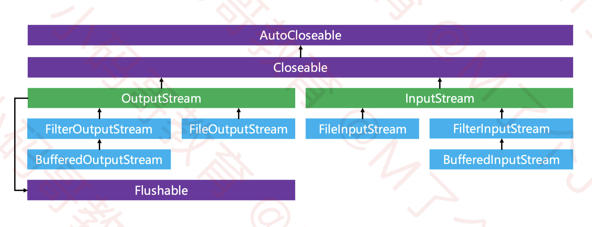


write写入需限制长度

定义的buffer数组用来缓存通过input读入的数据，因此定义的buffer大小只是决定了一次传入缓存的字节数量（注意：是while循环时一次传入的可读长度，而不是一直向buffer内传数据只能传1024），当然也可以将byte[ ]初始值定义成更大值。（切记：如果write时只使用write(buffer)而不是用长度n限制会由于buffer的初始值大小造成最终的输出流有问题。比如读取一个2049字节大小的文件时，初始值为byte[1024*2]，第一次input读取时buffer被填满2048个字节,但下次读取时还剩2049-2048=1位字节未读取，所以buffer缓存中仅是第一位内容更新，其余位置还是被上次读取的数据占位。因此output第二次写入的大小还是2048，这样最终写入文件的大小就是2048*2。）
————————————————

fileoutputstream 直接写入 

Filewriter 带缓冲

缓冲流 超过缓冲长度就写入

#### 16.网络协议

[两张动图-彻底明白TCP的三次握手与四次挥手](https://blog.csdn.net/qzcsu/article/details/72861891)

[淘宝二面，面试官居然把TCP三次握手问的这么详细](https://www.eet-china.com/mp/a44399.html)

#### 17.MYSQL

- count(*)包括了所有的列，相当于行数，在统计结果的时候，**不会忽略列值为NULL**  
- count(1)包括了忽略所有列，用1代表代码行，在统计结果的时候，**不会忽略列值为NULL** 
- count(列名)只包括列名那一列，在统计结果的时候，会忽略列值为空（这里的空不是只空字符串或者0，而是表示null）的计数，**即某个字段值为NULL时，不统计**。

JDBC中，对于ResultSet.getInt(), getLong()等获取基本数值型的函数，如果数据库中该字段是null，则函数的返回值是0。函数的返回值类型就已经决定了，不管怎么弄，也不可能返回null。
很多时候，通过在应用层限制不能在该字段中插入0值，可以实现是否为null的判断。如果应用无法限制，那该怎么办？
有一个勉强可用的方法：
1 在进行数值获取前，先通过ResultSet.getObject()来判断是否为null，这个函数可以明确地区分是null还是0；
2 如果不为null，则再通过ResultSet.getxxx()把值拿到，或者自己对ResultSet.getObject()返回的结果进行处理也可以。
从MySQL Connector/J的源码来看，getObject()返回的已经是进行解码并进行封装的基本值类对象，例如Integer，Long等。如果再通过ResultSet.getxxx()获取，Connector/J会再次进行解码，纯属浪费运算时间。

另一个方法是：
通过getxxx()把值拿到，然后通过wasNull()方法可确认刚获取到的值是否为null。这个方法能避免重复解码，也避免需要自己进行强制类型转换。唯一的限制是wasNull()方法只能在getxxx()后执行。

[数据实测告诉你：不要人云亦云的瞎说EXISTS 与 in 的区别](https://blog.csdn.net/leisure_life/article/details/120758666)

[MySQL如何选择float, double, decimal](http://blog.leanote.com/post/weibo-007/mysql_float_double_decimal)

like '%''l''%';->%'l'%

[关于MySQL varchar类型最大值，原来一直都理解错了](https://cloud.tencent.com/developer/article/1707401)

[MYSQL中的collate](https://www.jb51.net/article/214738.htm)  [Mysql的utf8与utf8mb4区别，utf8mb4_bin、utf8mb4_general_ci、utf8mb4_unicode_ci区别](https://blog.csdn.net/yzh_1346983557/article/details/89643071)


**mysql批处理的原理其实就是将设置的参数放进集合，然后再一起传入SQL中。** rewriteBatchedStatements=true

[JDBC中事务回滚savepoint](https://cloud.tencent.com/developer/article/2212733)

[MySQL事务隔离级别和实现原理（看这一篇文章就够了！）](https://zhuanlan.zhihu.com/p/117476959)

[spring事务,同一个类中非事务方法与事务方法执行相互调用](https://juejin.cn/post/6987278950686785544)

#### 18.Serverlet

绝对路径是以 / 开头的路径写法，编写绝对路径的原则是通过⽬标资源的uri访问⽬标资源，但是特殊情况是请求转 发，如果是请求转发访问⽬标资源的话，那么绝对路径是在uri的基础之上省略 /项⽬部署名

ServletConfig:可以获取配置在servlet中的初始化参数(getinitparamter) 不能修改

ServletContext:可以获取配置在web.xml(context-param)中的初始化参数(getinitparamter)不能修改,setAttribute(name,value)全局域对象传值


中文字符乱码问题 get请求 server.xml connector标签 URLEncoding=utf-8


#### 19.项目

```java
生产UUID
String str=UUID.randomUUID().toString();
创建当前时间
DateFormat dateFormat =new SimpleDateFormat("yyyy-MM-dd HH:mm:ss");
Date date =new Date();
String datestr=dateFormat.format(date);
```


#### 20.Maven

父项目依赖会传递给子项目(继承)

[Maven 依赖传递性透彻理解](https://juejin.cn/post/7005188338441256967)

#### 21.其他

[JDK 动态代理](https://juejin.cn/post/6974018412158664734#heading-9)

[stream 并行流 和 串行流](https://cloud.tencent.com/developer/article/1804918)

#### 22.spring

```java
HappyMachine happyMachine01 = (HappyMachine) iocContainer.getBean("happyMachine4");
HappyMachine happyMachine02 = (HappyMachine) iocContainer.getBean("happyMachine4");
happyMachine01==happyMachine02 true
默认单实例，同一个bean标签内多次创建相等 bean添加scope="prototype" false
```

autowired 只能挂载一个构造函数


[spring系列之——使用@Autowired注解，不建议基于字段的依赖注入](https://blog.csdn.net/weixin_59744818/article/details/120672431)

#### 24.aspect切面

<aop:aspectj-autoproxy />有一个proxy-target-class属性，默认为false，表示使用jdk动态代理织入增强，当配为<aop:aspectj-autoproxy poxy-target-class="true"/>时，表示使用CGLib动态代理技术织入增强。不过即使proxy-target-class设置为false，如果目标类没有声明接口，则spring将自动使用CGLib动态代理。(有实现接口，proxy-target-class=true也会用cglib代理)

**不同切面文件** 用order实现执行顺序


#### 25.mybatis

[常见问题](https://www.w3cschool.cn/mybatis/mybatis-ufvq3br0.html)

lazyLoadTriggerMethods 指定对象的哪些方法触发一次延迟加载。

```xml
<resultMap id="selectOrderNestResultMap" type="fsyb.entity.Order">
  <result column="order_id" property="orderId" />
  <result column="order_name" property="orderName" />
  <result column="customer_id" property="customerId"/>
  <association fetchType="lazy" property="customer4" column="{prop1=customer_id,prop2=order_name}" select="hfqs.dao.AccountMapper.selectCustomer" />
 </resultMap>

 <select id="selectOrderNest" resultMap="selectOrderNestResultMap">
  select order_id,order_name,customer_id from  t_order where order_id=#{order_id}
</select>
<select id="selectCustomer" resultType="fsyb.entity.Customer">
  select customer_id,customer_name from  t_customer where customer_id=#{prop1} or customer_id=#{prop2}
</select>
```

[mybatis基础学习（四）——动态sql](https://juejin.cn/post/6844903511663067149)

[MyBatis - 批量插入](https://developer.aliyun.com/article/933435)

[从七分钟到十秒，Mybatis 批处理真的很强！](https://www.51cto.com/article/707923.html)

[MyBatis 插件原理与自定义插件](https://www.cnblogs.com/wuzhenzhao/p/11120848.html)

[mybatis工作流程](https://www.cnblogs.com/wuzhenzhao/p/11103017.html)

[手把手教你开发 MyBatis 插件](https://segmentfault.com/a/1190000039305062)

```mysql
Cache Hit Ratio 0
SqlSession session = factory.openSession();
Cache mapper = session.getMapper(Cache.class);
Account ls = mapper.selectAccount(1000.0);

session.commit();
session.close();

Cache Hit Ratio 0.5

SqlSession session2 = factory.openSession();
Cache mapper2 = session2.getMapper(Cache.class);
Account ls2 = mapper2.selectAccount(1000.0);

session2.commit();
session2.close();

二级缓存存入时机 session 事务提交时存入
```


#### 26.springmvc

```java
@RequestMapping(value="/*")
public String showPortal() {
  return "portal";
}

spring-mvc.xml
<mvc:default-servlet-handler/>
<mvc:annotation-driven/>
如果都能匹配到 RequestMapping
```

#### 27.linux

[linux命令 ll信息详解](https://blog.csdn.net/dshf_1/article/details/99973236)

[5分钟让你明白“软链接”和“硬链接”的区别](https://www.jianshu.com/p/dde6a01c4094)

#### 28.redis

主从复制 从服务器下线以后再次登入取消主从关系


sdown 从服务器 odown 主服务器

[数据结构与算法——跳表](https://zhuanlan.zhihu.com/p/68516038)

[Redis--重写机制（减小AOF文件大小）](https://blog.51cto.com/knifeedge/5010466)

[Redis的AOF持久化](https://heapdump.cn/article/5106192)

[彻底搞懂 Redis 主从复制机制](https://zhuanlan.zhihu.com/p/151740247)

#### 29.springboot

[SpringBoot入门篇之properties中定义user.name失效解决](https://blog.csdn.net/m0_51390535/article/details/121233651)

[Spring @Value 注入List和Map](https://www.jianshu.com/p/1aa662a5f170)

#### 30.git

第一步，从远程仓库克隆到本地
git clone https://gitee.com/oldxxx/oldxxx.git
第二步，删除需要迁移的本地项目所关联的远程仓库地址
git remote remove origin
第三步，关联新仓库的地址
git remote add origin https://gitee.com/newxxx/newxxx.git
第四步，把项目推送到新的远程仓库
git push
第五步，从原仓库地址克隆一份裸版本库
git clone --bare https://gitee.com/oldxxx/oldxxx.git
第六步，原仓库所有分支同步新仓库
git push --mirro https://gitee.com/newxxx/newxxx.git
1、全局修改用户名、密码、邮箱
git config --global user.name "你的用户名"
git config --global user.password "你的密码"
git config --global user.email "你的邮箱"

2、修改隐藏文件.git->config->url
初始：url = https://gitee.com/用户名/项目名称.git
改后：url = https://用户名@gitee.com/用户名/项目名称.git

#### 31.nginx

[一份简单够用的 Nginx Location 配置讲解](https://juejin.cn/post/7048952689601806366)

[Nginx 前端 必知必会](https://juejin.cn/post/7231108358425624631?searchId=2023081610333839678E50329A822F99D2#heading-18)

[nginx gzip](http://www.yaohaixiao.com/blog/how-to-configure-gzip-compression-with-nginx/)

[nginx](https://blog.csdn.net/m0_69522116/article/details/129739232)

#### 32.rabbitmq

[消息确认](https://segmentfault.com/a/1190000022763182)

[RabbitMQ(五)消息发送失败后的处理](https://blog.csdn.net/qq315737546/article/details/66475103)
